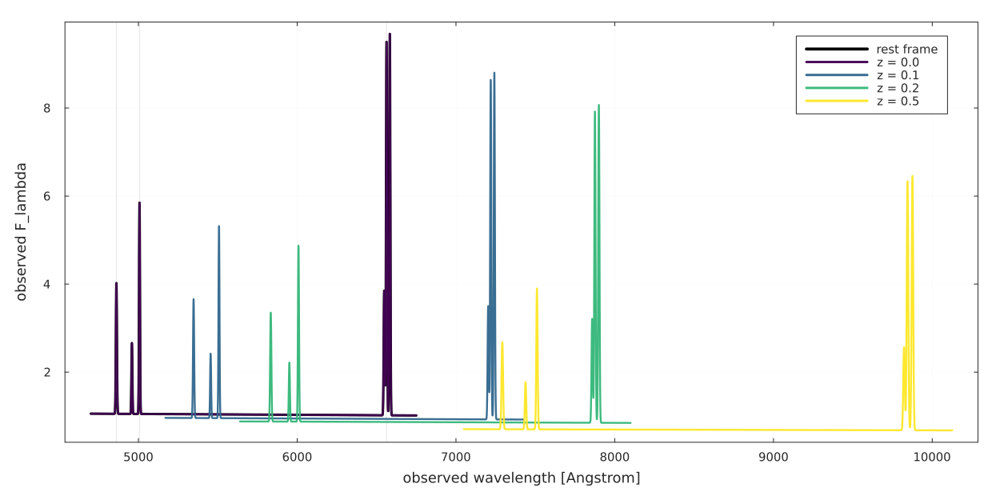

# AstroFit

Build, constrain, and fit parametric astrophysical models in Julia.

AstroFit is for workflows where the physics is full of constraints: shared line
centers, tied widths, fixed ratios, bounded amplitudes, reusable components, and
custom model pieces. Handwritten functions with those rules hardcoded are fast,
but they quickly become hard to reuse. AstroFit gives you composable models and
keeps the fitting hot path close to handwritten speed by compiling parameter
scatter and tie resolution into generated, straight-line code. ✨

Under the hood AstroFit uses
[Accessors.jl](https://github.com/JuliaObjects/Accessors.jl) to point into model
trees and rebuild immutable structs. The idea for this small library came while
reading [AccessibleModels.jl](https://github.com/JuliaAPlavin/AccessibleModels.jl),
which connects Accessors-style parameter selection with fitting and exploration
workflows.

> [!WARNING]
> AstroFit is a working proof of concept, not a production-ready package. It
> works for the workflows I built it for, but the API, documentation, and test
> coverage should still be treated as experimental. I wrote and maintain the
> repository myself, and AI assistance played an important role while designing
> the generated-function internals that make `withparams` fast.

- Define reusable model components with clear names.
- Attach physical constraints with `@constrain`.
- Fit with a flat parameter vector through fast `withparams(cm, p)`.
- Extend the system with plain Julia structs and `render` methods.

---

## Contents

- [Motivation](#motivation)
- [Quick Start](#quick-start)
- [Building Models](#building-models)
- [Complex Example](#complex-example)
- [Accessing Submodels](#accessing-submodels)
- [Adding Constraints](#adding-constraints)
- [Working With Parameters](#working-with-parameters)
- [Fitting Loop](#fitting-loop)
- [Benchmarks](#benchmarks)
- [Extending AstroFit](#extending-astrofit)
- [Internal Design](#internal-design)

---

## Motivation

Astrophysical models are rarely just independent parameters. A spectrum might
need two emission lines to share a velocity width, a doublet to keep a fixed flux
ratio, or a redshift component to move an entire rest-frame model.

You can hardcode those rules in one big Julia function. That is fast, but it
does not compose well. You can also use a model-management layer that resolves
constraints with runtime lookups, but that can add overhead in the fitting loop.

AstroFit aims for the useful middle ground: write models as reusable pieces,
express the constraints explicitly, then let Julia compile the resolved hot path.
Nice workflow, fast evaluation 🙂

---

## Quick Start

```julia
using AstroFit
using Optimization, OptimizationOptimJL
using ForwardDiff

m = @model begin
    narrow = Gaussian1D(amplitude=2.0, mean=6563.0, sigma=1.5)
    broad  = Gaussian1D(amplitude=0.5, mean=6563.0, sigma=8.0)
    narrow + broad
end

cm = @constrain m begin
    @bound narrow.amplitude in (0, Inf)
    @bound narrow.mean      in (6555.0, 6570.0)
    @bound narrow.sigma     in (0.1, Inf)
    @bound broad.amplitude  in (0, Inf)
    @tie   broad.mean       = narrow.mean
    @bound broad.sigma      in (1.0, Inf)
end

wavelengths = 6540.0:0.1:6590.0
flux = render(cm, wavelengths)
observed_flux = flux
err = fill(0.1, length(wavelengths))

prob = OptimizationProblem(cm, wavelengths, observed_flux, err)
sol = solve(prob, Fminbox(LBFGS()))

fit = withparams(cm, sol.u)
println(fit.narrow.amplitude)
```

What happened:

- `@model` created a named, composable model tree.
- `@constrain` added bounds and a tie.
- `OptimizationProblem(cm, x, y, err)` built a native `Optimization.jl` problem.
- `withparams(cm, sol.u)` rebuilt the fitted constrained model.

---

## Building Models

AstroFit models are immutable Julia structs. You evaluate them with `render`.

```julia
g = Gaussian1D(amplitude=1.0, mean=0.0, sigma=2.0)
render(g, 0.5)
render(g, -1:0.5:1)
```

### Named models with `@model`

Use block form when you want named components:

```julia
cm = @model begin
    cont = Linear1D(slope=0.0, intercept=1.0)
    ha   = Gaussian1D(amplitude=10.0, mean=6562.8, sigma=2.0)
    nii  = Gaussian1D(amplitude=3.0, mean=6583.4, sigma=2.0)
    cont + ha + nii
end
```

The final expression is the composition. Every bound name must appear in it.

Inline form also works:

```julia
a = Gaussian1D(amplitude=1.0, mean=0.0, sigma=1.0)
b = Const1D(value=0.5)
cm = @model a + b
```

### Composition operators

| Expression | Meaning |
|------------|---------|
| `a + b` | Sum of two models |
| `a - b` | Difference |
| `a * b` | Product |
| `a / b` | Quotient |
| `a ∘ b` | Pipe: `a(b(x))` |
| `a \|> b` | Pipe: `b(a(x))` |

Use named `Const1D` components instead of bare scalar constants, so constants
remain addressable and constrainable.

### Reusable prefabs

A component can itself be a constrained `CompiledModel`. Its constraints travel
with it and are namespaced under the parent component name.

```julia
ha_line = @constrain Gaussian1D(amplitude=10.0, mean=6562.8, sigma=2.0) begin
    @bound amplitude in (0, Inf)
    @bound sigma     in (0.1, Inf)
end

spectrum = @model begin
    cont = Linear1D(slope=0.0, intercept=1.0)
    ha   = ha_line
    cont + ha
end
```

If a prefab has internal ties, their master paths are re-rooted under the new
prefix automatically.

### Pipe example: redshift

```julia
Base.@kwdef struct Redshift1D{T<:Real} <: AbstractModel{1}
    z::T = 0.0
end
render(m::Redshift1D, λ) = λ / (1 + m.z)

z_shift = @constrain Redshift1D(z=0.05) begin
    @bound z in (0.0, 1.0)
end

observed = @model begin
    spectrum = rest_spectrum
    z_shift  = z_shift
    spectrum ∘ z_shift
end
```

---

## Complex Example

Here is a more realistic spectrum model: continuum + Hβ + [OIII] + Hα + [NII],
with the usual line ratios and shared kinematics written as constraints.

The observed-frame wrapper uses two tiny models:

- `RedshiftAxis`: maps `lambda_obs` to `lambda_rest = lambda_obs / (1 + z)`;
- `RedshiftFlux`: scales `F_lambda` by `1 / (1 + z)`.

Both use the same physical redshift through a tie:

```julia
Base.@kwdef struct RedshiftAxis{T<:Real} <: AbstractModel{1}
    z::T = 0.0
end
AstroFit.render(m::RedshiftAxis, lambda::Number) = lambda / (1 + m.z)

Base.@kwdef struct RedshiftFlux{T<:Real} <: AbstractModel{1}
    z::T = 0.0
end
AstroFit.render(m::RedshiftFlux, lambda::Number) = inv(1 + m.z)

observed = @model begin
    rest = rest_spec
    wavelength_shift = RedshiftAxis(z = 0.0)
    flux_scale = RedshiftFlux(z = 0.0)

    (rest ∘ wavelength_shift) * flux_scale
end

observed = @constrain observed begin
    @bound wavelength_shift.z in (0.0, 1.0)
    @tie   flux_scale.z = wavelength_shift.z
end
```

The rest-frame spectrum itself is still an ordinary AstroFit model. The [NII]
lines are tied to Hα, Hβ follows the Balmer decrement, and [OIII] keeps its fixed
doublet ratio.

```julia
rest_spec = @model begin
    cont = Linear1D(slope = -2.0e-5, intercept = 1.15)
    hbeta = Gaussian1D(amplitude = 2.4, mean = 4861.3, sigma = 2.8)
    oiii_b = Gaussian1D(amplitude = 1.6, mean = 4958.9, sigma = 2.8)
    oiii_r = Gaussian1D(amplitude = 4.8, mean = 5006.8, sigma = 2.8)
    ha = Gaussian1D(amplitude = 8.5, mean = 6562.8, sigma = 3.2)
    nii_b = Gaussian1D(amplitude = 1.0, mean = 6548.1, sigma = 3.2)
    nii_r = Gaussian1D(amplitude = 3.1, mean = 6583.4, sigma = 3.2)

    cont + hbeta + oiii_b + oiii_r + ha + nii_b + nii_r
end

rest_spec = @constrain rest_spec begin
    @tie nii_b.amplitude = ha.amplitude / 3.0
    @tie nii_r.amplitude = (3.06 / 3.0) * ha.amplitude
    @tie nii_b.mean      = (6548.1 / 6562.8) * ha.mean
    @tie nii_r.mean      = (6583.4 / 6562.8) * ha.mean
    @tie nii_b.sigma     = ha.sigma
    @tie nii_r.sigma     = ha.sigma

    @tie hbeta.amplitude = ha.amplitude / 2.86
    @tie hbeta.mean      = (4861.3 / 6562.8) * ha.mean
    @tie hbeta.sigma     = ha.sigma

    @tie oiii_b.amplitude = oiii_r.amplitude / 2.98
    @tie oiii_b.mean      = (4958.9 / 5006.8) * oiii_r.mean
    @tie oiii_b.sigma     = oiii_r.sigma
end
```

Rendered at `z = 0.0, 0.1, 0.2, 0.5`. The lines move to longer observed
wavelengths, and the `F_lambda` density is scaled by `1 / (1 + z)`.



Full script: [`examples/complex_redshifted_galaxy_spectrum.jl`](examples/complex_redshifted_galaxy_spectrum.jl).

---

## Accessing Submodels

The names you use inside `@model` become the names you use later. That makes
large models easy to inspect and compose.

From the complex example above:

```julia
observed.rest                 # the rest-frame spectrum
observed.wavelength_shift     # the RedshiftAxis component
observed.flux_scale           # the RedshiftFlux component

observed.rest.ha              # Halpha Gaussian
observed.rest.nii_r           # [NII] 6583 Gaussian
observed.rest.oiii_r.sigma    # a parameter inside the [OIII] component
observed.wavelength_shift.z   # the free redshift parameter
observed.flux_scale.z         # tied to wavelength_shift.z
```

This is the main ergonomic idea: compose models from named pieces, add
constraints at the model level, and still access the pieces with ordinary dot
syntax.

---

## Adding Constraints

`@constrain` takes a model and returns a new `CompiledModel` with updated
parameter rules.

```julia
cm = @constrain model begin
    @fix   component.param = value
    @fix   component.param
    @bound component.param in (lo, hi)
    @tie   component.param = expr(other.param, ...)
    @free  component.param
end
```

`@fix`, `@bound`, `@tie`, `@free` and `@prior` are clause macros that are only
valid inside a `@constrain` block — each carries its own docstring (try `?@fix`),
and using one outside `@constrain` raises an explanatory error.

### `@fix`

Lock a parameter and remove it from the fit vector.

```julia
cm = @constrain cm begin
    @fix narrow.mean = 6562.8
    @fix broad.mean
end
```

### `@bound`

Keep a parameter free, but give it lower and upper bounds.

```julia
cm = @constrain cm begin
    @bound narrow.amplitude in (0, Inf)
    @bound narrow.sigma     in (0.5, 20.0)
end
```

AstroFit checks bounds immediately. It does not silently clamp invalid values.

### `@tie`

Compute one parameter from one or more master parameters.

```julia
cm = @constrain cm begin
    @tie broad.mean  = narrow.mean
    @tie broad.sigma = narrow.sigma
    @tie blue.mean   = (4958.9 / 5006.8) * red.mean
    @tie blue.amp    = red.amp / 2.98
end
```

Tied targets are removed from the free parameter vector. Tie chains and self-ties
are rejected, so the dependency graph stays simple.

### `@free`

Release an existing constraint.

```julia
cm = @constrain cm begin
    @free narrow.sigma
end
```

### Merging constraints

Calling `@constrain` on an already constrained model merges the new rules with
the existing ones. The newest rule for a parameter wins.

```julia
spectrum = @constrain spectrum begin
    @bound ha.amplitude in (0, 100)
end
```

### Cross-component ties

Ties can reference sibling components and nested prefabs.

```julia
rest_spec = @constrain rest_spec begin
    @tie hbeta.amplitude = ha_nii.ha.amplitude / 2.86
    @tie hbeta.sigma     = oiii.blue.sigma
end
```

---

## Working With Parameters

### Flat parameter vectors

```julia
p = paramvector(cm)
nfree(cm)
freevals(cm)
```

`paramvector(cm)` contains only `Free` and `Bounded` parameters. `Fixed` and
`Tied` parameters are excluded.

### Bounds for optimizers

```julia
lo, hi = bounds_vectors(cm.spec)
```

The returned vectors align with `paramvector(cm)`.

### Rebuilding with `withparams`

```julia
cm_new = withparams(cm, p)
```

`withparams` scatters `p` into the free parameter positions, then re-resolves all
tied parameters. This is the function you call inside the fitting loop.

### Reading and updating values

```julia
cm.component.param
cm[:component].param

using AstroFit
cm2 = @set cm.narrow.amplitude = 3.5
```

`@set` validates bounds, rejects writes to tied parameters, and returns a new
tie-resolved `CompiledModel`.

---

## Fitting Loop

AstroFit ships an `Optimization.jl` extension, so most fits do not need a custom
loss function. Load `Optimization`, `OptimizationOptimJL`, and `ForwardDiff`, then
build the problem directly from the constrained model:

```julia
using Optimization, OptimizationOptimJL
using ForwardDiff

prob = OptimizationProblem(cm, wavelengths, observed_flux, err)
sol = solve(prob, Fminbox(LBFGS()))

fit = withparams(cm, sol.u)
```

`OptimizationProblem(cm, x, y, err)` uses the current free parameters as the
initial vector and reads `@bound` constraints as `lb` / `ub`. If the model has no
bounds, it leaves the problem unbounded, so solvers like `LBFGS()` or
`NelderMead()` work directly:

```julia
prob = OptimizationProblem(cm, wavelengths, observed_flux)
sol = solve(prob, NelderMead())
fit = withparams(cm, sol.u)
```

The objective is the negative log-likelihood:

- with `err`, it uses Gaussian errors;
- without `err`, it becomes the unit-variance least-squares objective;
- if the model has priors, the same path becomes a negative log-posterior.

2D models work the same way. Pass coordinates as a tuple:

```julia
prob = OptimizationProblem(cm2d, (X, Y), image, err)
sol = solve(prob, Fminbox(LBFGS()))
```

Under the hood, the extension wraps the same hot path you would write by hand:

```julia
loss(p) = -logposterior(cm, p, x, y, err)
```

That means the fit goes through `withparams(cm, p)`, so ties are resolved by the
compiled parameter engine rather than by runtime constraint lookup.

---

## Benchmarks

The benchmark asks one specific question:

> If a model has physical constraints, how much slower is AstroFit than the
> hand-written Julia function you would write for maximum speed?

```julia
render(withparams(cm, p), x)      # AstroFit
handwritten_constrained(p, x)     # hardcoded baseline
```

The hand-written baseline has no abstraction cost: the fixed values, bounds, and
ties are baked directly into the function body. That is the fastest version, but
it is also the least reusable one.

AstroFit keeps the reusable model representation, but it does not resolve ties by
walking names or doing constraint lookups at every evaluation. The constraint
spec is part of the `CompiledModel` type. When you call `withparams(cm, p)`,
generated functions emit straight-line code that:

- selects the free parameters;
- writes them into the model tree;
- recomputes tied parameters from their masters.

So the benchmark isolates the cost that should matter in a fit loop:

```julia
loss(p) = sum(abs2, render(withparams(cm, p), x) .- y)
```

If `withparams` is tiny and allocation-free, AstroFit gets the useful part of a
model manager without paying a runtime lookup cost for every constraint.


The current result is the one AstroFit is built around: constrained AstroFit
rendering stays close to the hand-written constrained baseline as models grow,
while `withparams` remains tiny and allocation-free in the measured cases. This
is the part we care about most 🙂

See [`bench/README.md`](bench/README.md) for the benchmark script, command, and
current numbers.

---

## Extending AstroFit

Any Julia struct that subtypes `AbstractModel{N}` can be an AstroFit model.

```julia
Base.@kwdef struct Redshift1D{T<:Real} <: AbstractModel{1}
    z::T = 0.0
end

Redshift1D(z::Real) = Redshift1D{typeof(float(z))}(float(z))

render(m::Redshift1D, λ) = λ / (1 + m.z)
```

Then use it like any built-in component:

```julia
z_shift = @constrain Redshift1D(z=0.05) begin
    @bound z in (0.0, 1.0)
end

observed = @model begin
    spectrum = rest_spectrum
    z_shift  = z_shift
    spectrum ∘ z_shift
end
```

Rules for custom models:

- subtype `AbstractModel{N}`;
- define scalar `render(m::YourModel, x::Number...)`;
- accept `Number`, not only `Float64`, so ForwardDiff dual values work;
- let AstroFit handle composition, naming, constraints, and `withparams`.

---

## Internal Design

This section describes the implementation in detail. It is not required for using the library, but is useful for contributors and for understanding performance characteristics.

### Architecture overview

AstroFit is built on three principles:

1. **Value semantics everywhere.** Models, specs, and `CompiledModel` are all immutable. Every operation (constraining, updating parameters) returns a new object. There is no shared mutable state.

2. **Type-encoded specification.** The constraint spec is a `Tuple` (not a `Vector`). Each entry's *type* encodes which constraint variant it holds (`Free`, `Bounded`, etc.). This means Julia's type inference can inspect the spec at compile time and generate specialized code — in particular, `@generated` functions that emit optimal code without runtime branching.

3. **Single invariant (I1).** The model tree stored in `.model` is always tie-resolved. This is enforced by routing every constructor through `_compiled`, which calls `resolve` before storing the tree. Code that reads `.model` never needs to re-resolve.

---

### Type hierarchy

```
AbstractModel{N}                        # abstract base; N = input dims
│
├── Gaussian1D{T<:Real}                 fields: amplitude, mean, sigma
├── Const1D{T<:Real}                    fields: value
├── Linear1D{T<:Real}                   fields: slope, intercept
├── Gaussian2D{T<:Real}                 fields: amplitude, x0, y0, sigma_x, sigma_y, theta
├── ExponentialDisk2D{T<:Real}          fields: amplitude, x0, y0, r_eff, ellip, theta
│
└── compound wrappers (binary; users don't construct these directly)
    ├── Sum{N, L<:AbstractModel{N}, R<:AbstractModel{N}}
    ├── Difference{N, L<:AbstractModel{N}, R<:AbstractModel{N}}
    ├── Product{N, L<:AbstractModel{N}, R<:AbstractModel{N}}
    ├── Quotient{N, L<:AbstractModel{N}, R<:AbstractModel{N}}
    └── Pipe{N, L<:AbstractModel{N}, R<:AbstractModel{1}}
        # inner: N-dim input → scalar
        # outer: scalar → scalar
        # combined: N-dim → scalar

CompiledModel{M, S<:Tuple, P<:Tuple, R<:NamedTuple}
    .model  :: M   — the resolved model tree
    .spec   :: S   — tuple of (optic, constraint) pairs
    .priors :: P   — tuple of (optic, distribution) pairs
    .names  :: R   — component name → optic or Registry

ComponentRef{CM<:CompiledModel, O, R<:NamedTuple}
    — a cursor into a named component; returned by property access on CompiledModel

Registry{O, R<:NamedTuple}
    — entry in .names when the component is itself a CompiledModel (prefab)
    — holds the optic to the subtree root + the prefab's own sub-registry
```

Compound wrappers hold their children in `.left` and `.right` fields, mirroring the operator argument order (or reversed for `∘`, since `a ∘ b` evaluates `a(b(x))`).

---

### Constraint types

```julia
struct Free end                        # no data; singleton type

struct Fixed{T}
    value::T                           # the locked value (T=Nothing means "lock at current")
end

struct Bounded{T}
    lower::T
    upper::T
end

struct Tied{F, Ms<:Tuple}
    f::F         # closure: f(master1_val, master2_val, ...) -> dependent_value
    masters::Ms  # tuple of optics pointing to each master parameter
end
```

Constraint types are deliberately minimal. The type tag (`Free`, `Fixed`, `Bounded`, `Tied`) is what `@generated` functions inspect at compile time — the variant is in the type, not a runtime tag field.

---

### `CompiledModel` internals

The four type parameters of `CompiledModel{M, S, P, R}` are all inferred from the arguments:

- **`M`**: the concrete model tree type (e.g. `Sum{1, Gaussian1D{Float64}, Gaussian1D{Float64}}`). This changes every time a parameter changes type (e.g. when ForwardDiff substitutes `Dual` for `Float64`).
- **`S`**: the spec tuple type. This encodes the number of constrained parameters, their optic types, and their constraint variant types. It is fixed for the lifetime of a compiled model — `@constrain` produces a new `S`, but `withparams` preserves it.
- **`P`**: the prior tuple type. Same structure as `S`.
- **`R`**: the names `NamedTuple` type. Encodes the component names as type-level symbols. Fixed after `@model`.

**Invariant I1** is maintained by the private constructor `_compiled`:

```julia
_compiled(model, spec, names, priors=()) =
    CompiledModel(resolve(model, spec), spec, priors, names)
```

`resolve(model, spec)` calls `_resolve(model, tied_entries(spec))`, which iterates over all `Tied` entries and writes the computed values into the model tree. Because every public-facing operation (constraint application, parameter update, `@set`) routes through `_compiled`, I1 holds everywhere.

---

### `@model` macro pipeline

The `@model` macro transforms a composition expression into a `CompiledModel`. Here is the full pipeline:

```
Source code                   Macro expansion (compile time)
─────────────────────────────────────────────────────────────

@model begin                  1. Parse block: extract bindings + composition expr
  a = M1                         bindings = [a => M1, b => M2]
  b = M2                         comp_expr = :(a + b)
  a + b
end                           2. _walk_optics(comp_expr)
                                 Walks the expression tree recursively.
                                 a + b  → Sum has .left=a, .right=b
                                 Returns: [a => [:left], b => [:right]]

                              3. _path_to_optic_expr([:left])
                                 → PropertyLens{:left}()
                                 _path_to_optic_expr([:right])
                                 → PropertyLens{:right}()
                                 (deeper paths: lens1 ⨟ lens2 ⨟ ...)

                              4. Build the composition closure:
                                 (ga, gb) -> ga + gb
                                 (leaf symbols replaced with gensym args)

                              5. Emit call to _build_model:
                                 _build_model(closure, (:a, :b),
                                              (PropertyLens{:left}(), PropertyLens{:right}()),
                                              (M1, M2))

Runtime (_build_model)
──────────────────────

_build_model(f, names, optics, values):
  1. bare = map(_strip_leaf, values)
       CompiledModel → its .model field
       AbstractModel → as-is
       anything else → error

  2. tree = f(bare...)
       Calls the closure: Sum(M1_bare, M2_bare)
       This builds the actual model tree.

  3. _identity_check(tree, names, optics, bare)
       For each (name, optic, bare_leaf):
         optic(tree) === bare_leaf   (identity check, not ==)
       Guards against bugs in _walk_optics.

  4. spec = _collect_spec(optics, values)
       For a bare AbstractModel at optic o:
         map each field f to (o ⨟ PropertyLens{f}(), Free())
       For a CompiledModel (prefab) at optic o:
         map each (t, c) in prefab.spec to (_compose(o, t), _reroot(o, c))
         _reroot rewrites Tied masters: each master optic m → _compose(o, m)

  5. priors = _collect_priors(optics, values)
       Same logic for prior entries.

  6. registry = NamedTuple{names}(map(_registry_entry, optics, values))
       For AbstractModel at optic o:   entry = o  (the optic itself)
       For CompiledModel at optic o:   entry = Registry(o, prefab.names)

  7. _compiled(tree, spec, registry, priors)
       → CompiledModel (with I1 established via resolve)
```

**`_walk_optics` for `∘` and `|>`:**

`a ∘ b` creates `Pipe(b, a)` (inner=b, outer=a), so `a` lives at `.right` and `b` at `.left`. The walker reflects this:
- `a ∘ b`: `a → [:right]`, `b → [:left]`
- `a |> b`: `a → [:left]`, `b → [:right]`

---

### `@constrain` macro pipeline

`@constrain` generates runtime code that resolves component names against the registry, builds constraint entries, and calls `_constrain`.

```
Source code                   Macro expansion (compile time)
─────────────────────────────────────────────────────────────

@constrain cm begin            1. Parse block: iterate over directives
  @fix   a.x = 1.0                Each directive produces one entry expression.
  @bound a.y in (0, Inf)
  @tie   b.z = a.x * 2.0      2. For each path (e.g. a.x):
end                                 _extract_path(:(a.x))  →  (:a, :x)
                                    optic_expr = :(_resolve_path(cm_var, (:a, :x)))

                              3. For @tie b.z = a.x * 2.0:
                                 _extract_and_replace_masters(:(a.x * 2.0))
                                   → replaced_rhs:  :(m_gensym1 * 2.0)
                                   → masters: [(:a,:x) => :m_gensym1]
                                 closure:  (m_gensym1,) -> m_gensym1 * 2.0
                                 master_optics: [_resolve_path(cm_var, (:a,:x))]
                                 entry:  (optic_for_b_z, Tied(closure, (master_optic,)))

                              4. Emit:
                                 let cm_var = _as_compiled(cm)
                                   _constrain(cm_var,
                                     (optic_for_a_x, Fixed(1.0)),
                                     (optic_for_a_y, Bounded(0, Inf)),
                                     (optic_for_b_z, Tied(closure, (master_optic,))))
                                 end

Runtime (_resolve_path)
───────────────────────

_resolve_path(cm, (:a, :x)):
  1. Look up :a in cm.names  → entry (optic or Registry)
  2. If Registry: compose registry.optic with descent into registry.names for rest of path
  3. If optic + remaining path symbols: compose with PropertyLens for each

Runtime (_constrain)
────────────────────

_constrain(cm, entries, prior_entries):
  1. Validate targets: each target optic must point to a scalar, not a subtree.
  2. _dedupe_last(entries): within the new block, last entry per target wins.
  3. Merge with existing spec:
       merged = (filter old entries not overridden by new) ++ new entries
  4. _validate_spec(merged):
       V1: no tie chains (a master cannot itself be Tied)
       V2: no self-ties (target is its own master)
       V3: sane bounds (lo < hi)
  5. model = _apply_fixed(model, new entries)
       Writes Fixed values into the tree (only entries from THIS block).
       Older Fixed entries are already baked into .model.
  6. _check_bounds(model, merged):  V4: current values inside bounds
  7. _compiled(model, merged, names, priors)  ← I1 re-established
```

---

### Parameter engine

The parameter engine is the hot path called inside every iteration of the fitting loop. Its goal: scatter a `Vector{Float64}` (or `Vector{Dual}`) into the model tree with zero dynamic dispatch and zero heap allocation beyond the new model struct.

Three `@generated` functions make this possible.

#### `free_lenses` — compile-time parameter selection

```julia
@generated function free_lenses(spec::Tuple)
    idx = [k for (k, T) in enumerate(spec.parameters)
           if _constraint_type(T) <: Union{Free, Bounded}]
    Expr(:tuple, (:(spec[$k][1]) for k in idx)...)
end
```

`spec` has type `Tuple{Tuple{Optic1,Free}, Tuple{Optic2,Fixed{Float64}}, Tuple{Optic3,Bounded{Float64}}, ...}`. The `@generated` body runs at *compile time* (when specializing on the spec type) and inspects `spec.parameters` — the type-level description of each tuple element.

For a spec where entries 1 and 3 are `Free`/`Bounded` and entry 2 is `Fixed`, the emitted code is literally:

```julia
(spec[1][1], spec[3][1])
```

A constant-structure tuple expression. No loops, no runtime type checks. Calling `free_lenses` on a fixed spec type is as cheap as reading two fields.

#### `_set` — straight-line lens application

```julia
@generated function _set(obj, lens, v)
    prims = try
        _primitive_lenses(lens)
    catch
        nothing
    end
    prims === nothing && return :(set(obj, lens, v))
    _set_expr(:obj, :lens, :v, prims)
end
```

`_primitive_lenses` decomposes a `ComposedFunction{O,I}` (an Accessors composed lens) into a flat vector of primitive lenses at compile time:

```
PropertyLens{:a}() ⨟ PropertyLens{:b}() ⨟ PropertyLens{:c}()
→ [PropertyLens{:a}(), PropertyLens{:b}(), PropertyLens{:c}()]
```

`_set_expr` then emits a straight-line get-down / set-up block. For a 3-level lens:

```julia
begin
    @inline
    o1 = obj             # root
    o2 = lens_a(o1)      # descend with lens a
    o3 = lens_b(o2)      # descend with lens b
    s1 = set(o3, lens_c, v)   # set the leaf
    s2 = set(o2, lens_b, s1)  # rebuild level 2
    s3 = set(o1, lens_a, s2)  # rebuild level 1
    s3
end
```

**Why not use recursive `Accessors.set` directly?** The standard `Accessors.set` on a `ComposedFunction` is recursive. Julia's type inference has a recursion limit (roughly 100 frames by default). For deeply nested models — or when the value type changes (e.g., `Float64` → `Dual{Tag,Float64,N}` during ForwardDiff differentiation) — the recursive form hits this limit, falls back to dynamic dispatch, and allocates on every call.

The straight-line form produced by `_set_expr` has a bounded, constant depth from the compiler's perspective. Each individual `set(o, primitive_lens, v)` call is a simple struct update, fully inferable regardless of value type.

#### `_scatter` — unrolled parameter write

```julia
@generated function _scatter(model, lenses::Tuple, vals)
    N = length(lenses.parameters)
    out  = Expr(:block, Expr(:meta, :inline), :(m0 = model))
    prev = :m0
    for k in 1:N
        mk = Symbol(:m, k)
        push!(out.args, :($mk = _set($prev, lenses[$k], @inbounds(vals[$k]))))
        prev = mk
    end
    push!(out.args, prev)
    out
end
```

At compile time, `N` = the number of free parameters (known from the lenses tuple type). The emitted code for N=3:

```julia
begin
    @inline
    m0 = model
    m1 = _set(m0, lenses[1], @inbounds(vals[1]))
    m2 = _set(m1, lenses[2], @inbounds(vals[2]))
    m3 = _set(m2, lenses[3], @inbounds(vals[3]))
    m3
end
```

Each `_set` call changes the model's type (because it creates a new immutable struct with a potentially different field type). The sequential unrolling allows the compiler to track the type chain `m0 → m1 → m2 → m3` without inference ambiguity.

#### `withparams` — the full hot path

```julia
withparams(cm::CompiledModel, p) =
    _compiled(
        _scatter(getfield(cm, :model), free_lenses(getfield(cm, :spec)), p),
        getfield(cm, :spec), getfield(cm, :names), getfield(cm, :priors)
    )
```

Call chain for a model with 3 free parameters:

```
withparams(cm, p)
│
├─ free_lenses(cm.spec)          [compile-time: emits (spec[1][1], spec[3][1])]
│    → (optic_1, optic_3)        [runtime: field reads, O(1)]
│
├─ _scatter(cm.model, lenses, p) [compile-time: unrolls 3 _set calls]
│    m0 = cm.model
│    m1 = _set(m0, optic_1, p[1])   [straight-line, no dispatch]
│    m2 = _set(m1, optic_3, p[2])
│    → m2                            [updated model tree, no heap alloc]
│
└─ _compiled(m2, cm.spec, cm.names, cm.priors)
     └─ resolve(m2, cm.spec)    [re-evaluates all Tied parameters]
          → CompiledModel(m2_resolved, cm.spec, cm.priors, cm.names)
```

The only allocations are the new model structs (unavoidable for immutable value semantics) and the final `CompiledModel` wrapper. No intermediate arrays or closures are created.

---

### Optic composition helpers

Two small utilities are used throughout to manage optic equality and composition:

```julia
_compose(::typeof(identity), ::typeof(identity)) = identity
_compose(::typeof(identity), o) = o
_compose(o, ::typeof(identity)) = o
_compose(a, b) = a ⨟ b
```

`_compose` avoids wrapping optics in unnecessary `ComposedFunction` layers when one side is `identity`. This matters because `_primitive_lenses` must decompose lenses at compile time — a spurious `identity` wrapper would appear as a primitive and generate a no-op `set` call.

```julia
_optic_leaves(o::ComposedFunction) = (_optic_leaves(o.inner)..., _optic_leaves(o.outer)...)
_optic_leaves(::typeof(identity)) = ()
_optic_leaves(o) = (o,)
_same_optic(a, b) = _optic_leaves(a) == _optic_leaves(b)
```

`_same_optic` flattens both optics to their primitive sequence before comparing. This makes structural equality robust to composition associativity: `(a ⨟ b) ⨟ c` and `a ⨟ (b ⨟ c)` both flatten to `(a, b, c)` and compare equal.

`_same_optic` is used in `_constrain` to detect which existing spec entries are overridden by new ones, and in `_validate_spec` to detect self-ties and tie chains.

---

### ForwardDiff compatibility

AstroFit is fully compatible with ForwardDiff. The fitting loop can differentiate through `withparams` and `render` with no extra effort.

ForwardDiff substitutes `Float64` with `Dual{Tag, Float64, N}` in the parameter vector. This changes the type of `p` (and subsequently of the model tree after `_scatter`). The generated code handles this transparently because:

1. `_set` produces straight-line code where each `set(o, primitive_lens, v)` is a struct constructor call. Julia can infer the output type of each call regardless of whether `v` is `Float64` or `Dual`.

2. `_scatter` sequentially chains `_set` calls. Since each output type is inferable, the compiler tracks `m0::Model{Float64}` → `m1::Model{Dual}` → ... without hitting inference limits.

3. `render` on leaf models is a scalar arithmetic expression (`m.amplitude * exp(...)` etc.) which ForwardDiff differentiates through automatically.

**When does recompilation occur?**

Julia specializes on types, not values. Recompilation happens when the *type* of an argument changes:

| Scenario | Recompiles? |
|----------|-------------|
| Same model, same optimizer, different parameter values | No |
| First call with ForwardDiff (Float64 → Dual) | Yes, once |
| Different chunk size `N` in `Dual{Tag,V,N}` | Yes, once per `N` |
| Different function type in ForwardDiff tag | Yes, once per function type |

The last point is the most common pitfall. ForwardDiff's tag includes the function type: `Tag{F, V}`. If `F` is an anonymous closure created freshly each call (e.g., `p -> loss(cm, p)` written inside a loop), its type changes each iteration, triggering recompilation every time. The `Optimization.jl` extension gives you a stable path for normal fits. If you write your own objective, prefer a named callable type over recreating closures in a loop.

Once compiled, subsequent calls with the same type combination hit the cache and pay no compilation overhead.
