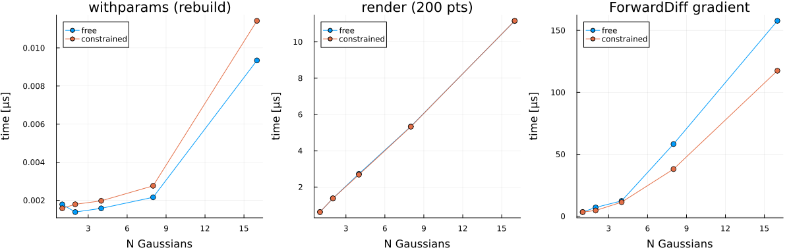
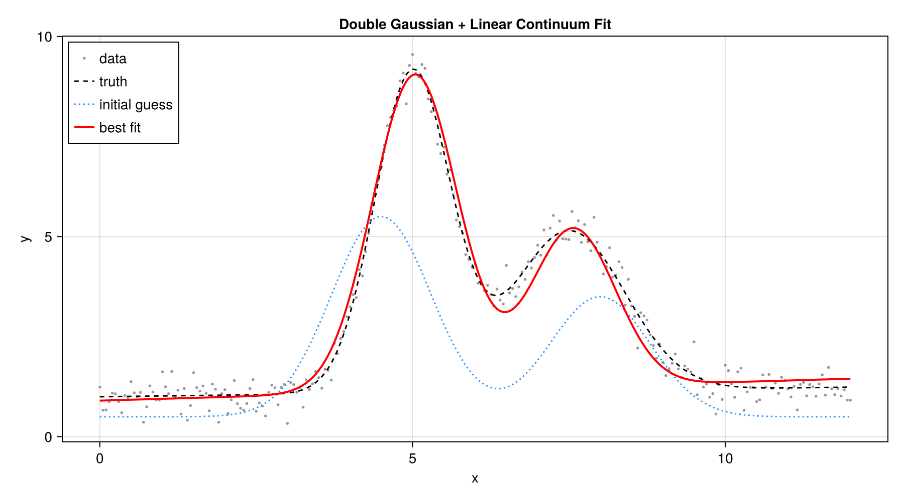
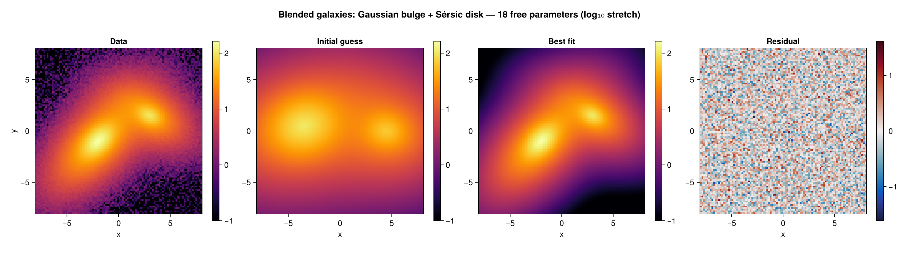
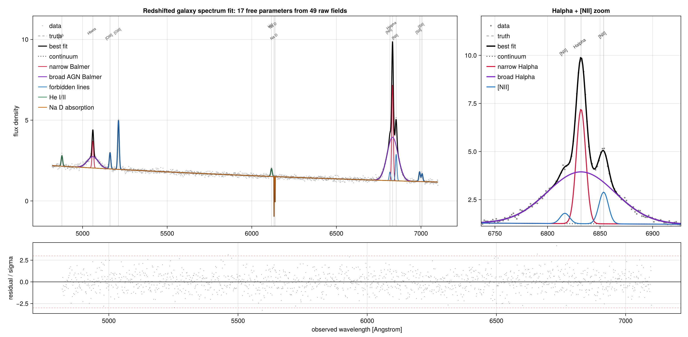
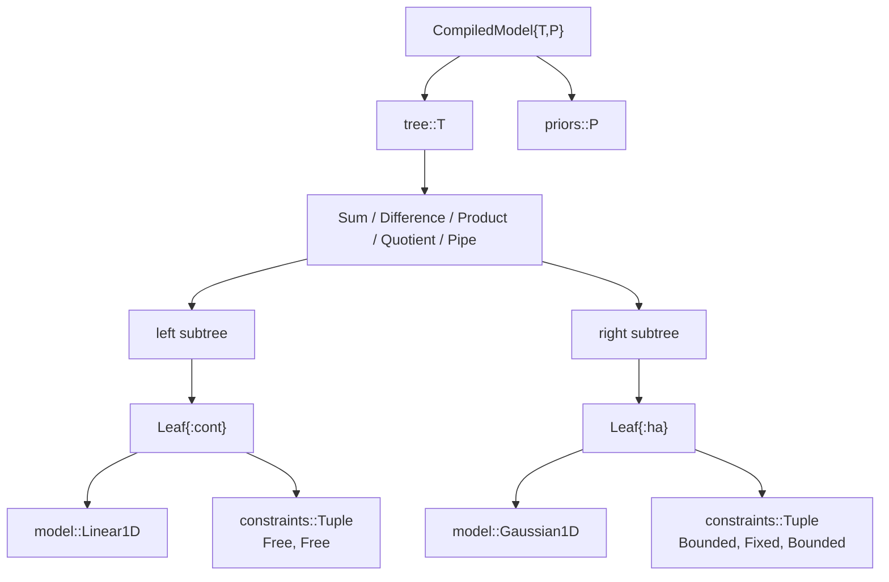

[](https://github.com/fredrikekre/Runic.jl)
[](https://github.com/JuliaTesting/Aqua.jl)

# AstroFit

Build, constrain, and fit parametric astrophysical models in Julia.

AstroFit is for workflows where the physics is full of constraints: shared line
centers, tied widths, fixed ratios, bounded amplitudes, reusable components, and
custom model pieces. Handwritten functions with those rules hardcoded are fast,
but they quickly become hard to reuse. AstroFit gives you composable models and
keeps the fitting hot path close to handwritten speed by compiling parameter
scatter and tie resolution into generated, straight-line code.

I started this because I missed the way [Astropy modeling](https://docs.astropy.org/en/stable/modeling/) and [lmfit](https://lmfit.github.io/lmfit-py/) let you snap models together, but I wanted that in Julia where the compiler can actually inline everything. [`AccessibleModels`](https://github.com/) was another reference point for the composable-model idea.

> [!WARNING]
> AstroFit is a working proof of concept, not a
> production-ready package. It works for the workflows I built it for, but the API,
> documentation, and test coverage should still be treated as experimental. I
> wrote and maintain the repository myself, and AI assistance played an important
> role while designing the generated-function internals that make
> `withparams` fast.

- Define reusable model components with clear names.
- Attach physical constraints with `@constrain`.
- Fit with a flat parameter vector through fast `withparams(cm, p)`.
- Extend the system with plain Julia structs and `render` methods.

---

## Installation

```julia
using Pkg
Pkg.add(url="https://github.com/m4ttes4/AstroFit.jl")
```

## Contents

- [Installation](#installation)
- [Motivation](#motivation)
- [Quick Start](#quick-start)
- [Building Models](#building-models)
- [Adding Constraints](#adding-constraints)
- [Working With Parameters](#working-with-parameters)
- [Fitting](#fitting)
- [Optimization.jl Integration](#optimizationjl-integration)
- [Future Progress](#future-progress)
- [Benchmarks](#benchmarks)
- [Real Examples](#real-examples)
- [Extending AstroFit](#extending-astrofit)
- [Internal Design](#internal-design)


## Motivation

In astrophysics, parameters are rarely independent: two emission lines share a
velocity width, a doublet has a fixed flux ratio, a redshift shifts the entire
rest-frame model. Constraints are the rule, not the exception.

You can write a monolithic Julia function that hardcodes everything. It's fast,
but the moment you change the setup — add a line, drop a constraint — you end up
rewriting half the code. Or you use a layer that resolves constraints with
runtime lookups, but you pay that cost on every fit iteration.

AstroFit tries to sit in the middle: write model components as reusable pieces,
declare constraints explicitly, and let Julia compile the resolved path. The
model stays inspectable and easy to modify, but the inner loop comes down to
`withparams(cm, p)` plus `render` — no lookups, no overhead.

Models are composed with binary operators (`+`, `*`, `|>`), a pattern common
across fitting libraries because it makes the structure of a model immediately
obvious: `continuum + line_ha + line_nii` reads like what it is. You see the
physics, not the plumbing.


## Quick Start

```julia
using AstroFit
using Optimization, OptimizationOptimJL, ForwardDiff

# 1. Noisy data: an emission line on a flat continuum
λ        = collect(6540.0:0.5:6590.0)
truth    = Const1D(value=1.0) + Gaussian1D(amplitude=5.0, mean=6563.0, sigma=2.0)
observed = render(truth, λ) .+ 0.1 .* randn(length(λ))

# 2. Build a model with a rough initial guess
spec = @model begin
    cont = Const1D(value=0.5)
    ha   = Gaussian1D(amplitude=3.0, mean=6560.0, sigma=3.0)
    cont + ha
end

# 3. Physical constraints: amplitude and width must be positive
@constrain spec begin
    ha.amplitude in (0, Inf)
    ha.sigma     in (0.1, Inf)
end

# 4. Fit — AstroFit builds the problem straight from the model and data
prob = OptimizationProblem(spec, λ, observed)
sol  = solve(prob, Optim.Fminbox(Optim.LBFGS()))

best = withparams(spec, sol.u)   # fitted model: recovers amplitude≈5, mean≈6563, sigma≈2
```

What happened:

- `@model` built a named, composable model tree (`cont + ha`).
- `@constrain` attached bounds in place, rebinding `spec`.
- `OptimizationProblem(spec, λ, observed)` read `params(spec)` as the starting point
  and `bounds(spec)` as the box, automatically.
- `withparams(spec, sol.u)` rebuilt the fitted model — print it to see the tree
  with its final values.


## Building Models

AstroFit models are plain Julia structs. Each one represents a single
component — a gaussian, a constant, a power law — and you evaluate it with
`render`:

```julia
g = Gaussian1D(amplitude=3.0, mean=5.0, sigma=1.2)
render(g, 5.0)           # scalar: value at that point
render(g, 0:0.1:10)      # vector: automatic broadcast
```

Every built-in model has keyword arguments with defaults — you can omit the
ones you don't need:

```julia
c = Const1D(value=2.0)
l = Linear1D(slope=0.3)         # intercept = 0.0 by default
```

### Composing components

Components combine with ordinary operators — no special syntax needed:

| Expression | Meaning |
|------------|---------|
| `a + b` | Sum of two models |
| `a - b` | Difference |
| `a * b` | Product |
| `a / b` | Quotient |
| `a ∘ b` | Pipe: `a(b(x))` |
| `a \|> b` | Pipe: `b(a(x))` |

```julia
# an emission line on a flat continuum
m = Const1D(value=1.0) + Gaussian1D(amplitude=4.0, mean=5.0, sigma=0.5)
render(m, 5.0)   # ≈ 5.0

# an absorption line on a linear continuum
m = Linear1D(slope=0.1, intercept=2.0) - Gaussian1D(amplitude=0.5, mean=3.0, sigma=0.3)
```

This is enough to build and evaluate composite models. But if you want to
**constrain** parameters (fix values, set bounds, tie one parameter to
another) or **fit** the model to data, you need one more step.

### `@model`: giving names to components

Constraints and fitting reference components by name — "fix `ha.mean`",
"tie `line_b.sigma` to `line_a.sigma`". Plain composition like
`Gaussian1D(...) + Const1D(...)` is anonymous: there is no way to point at a
specific component.

`@model` solves this. Each assignment gives a name; the final expression
defines the composition:

```julia
spec = @model begin
    bg     = Linear1D(slope=0.01, intercept=1.0)
    line_a = Gaussian1D(amplitude=6.0, mean=4861.0, sigma=1.5)
    line_b = Gaussian1D(amplitude=2.0, mean=4959.0, sigma=1.5)
    bg + line_a + line_b
end
```

What this does:

- Each `name = Model(...)` creates a named component. The name is how you
  refer to it in `@constrain`, `@fix`, `@tie`, and when inspecting results.
- The last expression (`bg + line_a + line_b`) is the composition.
  Every name must appear in it.
- The result is a `CompiledModel` — the object that carries constraints
  and exposes `params`, `bounds`, `withparams`, and the rest of the fitting
  API.
- All parameters start as free (unconstrained). Use `@constrain` to change
  that.

### Inspecting components

After building a model with `@model`, you access any named component as a
property:

```julia
spec.line_a              # the named component :line_a
spec.line_a.model        # Gaussian1D(6.0, 4861.0, 1.5)
spec.line_a.constraints  # constraint on each field: (Free(), Free(), Free())
```

This is how you check values and constraint state at any point — before
fitting, after fitting, or while debugging.


## Adding Constraints

After `@model`, all parameters are free — the optimizer can move any of them.
Constraints lock some down: fix a known wavelength, bound an amplitude to be
positive, tie two line widths so they share the same velocity dispersion.
Each constraint removes a degree of freedom from the fit.

There are four kinds:

| Kind | Meaning | Optimizer slot? |
|------|---------|----------------|
| `Free()` | unconstrained — the optimizer controls it | yes |
| `Bounded(lo, hi)` | free, but confined to `[lo, hi]` | yes |
| `Fixed(v)` | pinned to a constant — never moves | no |
| `Tied(masters, f)` | computed from other free parameters: `f(master₁, …)` | no |

A `Tied` parameter references one or more free (or bounded) masters. Its
value is always derived, never independent — so the optimizer never sees it.
Ties cannot chain: every master must itself be `Free` or `Bounded`.

### `@constrain` block

The most common way to add constraints. Inside the block, leaf names are
bare (no `spec.` prefix), and each constraint kind has its own operator:

| Syntax | Constraint | Example |
|--------|-----------|---------|
| `field = value` | Fix to a constant | `line_a.mean = 4861.0` |
| `field in (lo, hi)` | Bound to an interval | `line_a.amplitude in (0, Inf)` |
| `field -> expr` | Tie to other parameters | `line_b.sigma -> line_a.sigma` |
| `field ~ dist` | Bayesian prior | `line_a.sigma ~ LogNormal(0, 0.5)` |
| `field` (bare) | Fix at current value | `line_a.mean` |
| `@free field` | Release back to free | `@free line_a.mean` |

```julia
@constrain spec begin
    line_a.mean       = 4861.0              # fix: known Hβ wavelength
    line_b.mean       = 4959.0              # fix: known [OIII] wavelength
    line_a.amplitude  in (0, Inf)           # bound: emission only
    line_b.amplitude  in (0, Inf)
    line_b.sigma      -> line_a.sigma       # tie: same velocity width
end

nfree(spec)        # 5
paramnames(spec)   # [:bg_slope, :bg_intercept, :line_a_amplitude, :line_a_sigma, :line_b_amplitude]
```

After adding constraints (see next section), the display updates to reflect
them — fixed values turn red, bounds show their interval, tied parameters
show their master:

```
julia> spec   # after @constrain
CompiledModel  ·  3 free  ·  2 bounds  ·  2 fixed  ·  1 tied
formula: bg + line_a + line_b
+
├─ bg :: Linear1D
│  ├─ slope      0.01    free
│  └─ intercept  1.0     free
├─ line_a :: Gaussian1D
│  ├─ amplitude  6.0     bounds [0.0, Inf]
│  ├─ mean       4861.0  fixed
│  └─ sigma      1.5     free
└─ line_b :: Gaussian1D
   ├─ amplitude  2.0     bounds [0.0, Inf]
   ├─ mean       4959.0  fixed
   └─ sigma      1.5     tied -> line_a.sigma
```

Constraining the same parameter twice in one block is a compile-time error —
no silent overwrites.

### Standalone constraint macros

For quick one-off edits outside a block, each macro targets one parameter
and automatically rebinds the model variable:

```julia
@fix   spec.line_a.mean = 4861.0                          # pin to a value
@bound spec.line_a.amplitude in (0, Inf)                   # set bounds
@tie   spec.line_b.sigma -> spec.line_a.sigma              # tie to another parameter
@free  spec.line_a.mean                                    # release back to free
```

Note: standalone macros use the full path (`spec.line_a.field`), while
`@constrain` uses bare names (`line_a.field`).

### Programmatic constraints with `setconstraint`

The macros lower to `setconstraint`, which you can call directly when
building constraints in a loop or from data:

```julia
s = setconstraint(spec, :line_a, :sigma, Bounded(0.5, 10.0))
s = setconstraint(s, :line_b, :sigma, Tied(((:line_a, :sigma),), identity))
validate(s)   # checks all ties point at free masters; throws otherwise
```


## Working With Parameters

### Free parameters

```julia
nfree(spec)        # number of free (+ bounded) parameters
params(spec)       # current free values (p₀ for the optimizer)
paramnames(spec)   # slot labels: [:bg_slope, :bg_intercept, :line_a_amplitude, …]
bounds(spec)       # (lower, upper) vectors aligned with params
```

All four accessors walk the tree in the same left-to-right order
`withparams` uses to assign slots, so they always line up.

### Rebuilding with `withparams`

```julia
model = withparams(spec, params(spec))
```

`withparams` scatters the flat parameter vector into the free positions,
re-resolves all tied parameters, and returns the **bare** model tree (Leaf
wrappers stripped). This is the function you call inside the fitting loop.

For example, if `line_b.sigma -> line_a.sigma`, the optimizer never sees a
separate `line_b_sigma` slot. `withparams` rebuilds a plain model where that
field has already been computed from `line_a_sigma`, so `render` does not
need to know about constraints.

---

## Fitting

AstroFit provides a built-in likelihood layer and a solver-agnostic `objective`
function. You can also write a plain loss function by hand — either way, the hot
path is `withparams` + `render`.

### Built-in objective

`objective(cm, x, y)` returns a closure `u -> -logposterior(cm, u, x, y, err)`
ready to **minimise** over the flat parameter vector. Without priors it is the
negative Gaussian log-likelihood; with `err = nothing` (the default) it assumes
unit variance (equivalent to least squares):

```julia
λ = collect(6540.0:0.5:6590.0)
y = render(withparams(fit, params(fit)), λ)

loss = objective(fit, λ, y)
loss(params(fit))   # minimum at the truth
```

Pass per-point standard deviations to get a weighted likelihood:

```julia
err = fill(0.1, length(y))
loss_w = objective(fit, λ, y; err)
```

The objective is fully differentiable — gradient-based optimizers and AD work
out of the box:

```julia
using ForwardDiff
ForwardDiff.gradient(loss, params(fit))   # 5-element gradient
```

### Manual loss function

If you need a custom objective (e.g. Cash statistic, regularisation), build it
directly from `withparams` + `render`:

```julia
loss_lsq(p) = sum(abs2, render(withparams(fit, p), λ) .- y)
```

### Choosing a solver

`params(fit)` gives the starting point, `bounds(fit)` gives the box. Hand them
to any Julia optimizer:

```julia
# using Optim
# lo, hi = bounds(fit)
# res = optimize(loss, lo, hi, params(fit), Fminbox(LBFGS()))
# best = withparams(fit, Optim.minimizer(res))
```


## Optimization.jl Integration

AstroFit ships a package extension for
[Optimization.jl](https://github.com/SciML/Optimization.jl). Loading
`Optimization` and `ForwardDiff` together activates it — no extra import needed.

First, some synthetic data to work with:

```julia
using AstroFit

λ = collect(-5.0:0.1:5.0)
true_model = Const1D(1.0) + Gaussian1D(5.0, 0.0, 1.0)
y = render(true_model, λ) .+ 0.01 .* randn(length(λ))
```

Now build a model with an initial guess, add constraints, and fit:

```julia
using Optimization, ForwardDiff, OptimizationOptimJL

spec = @model begin
    cont = Const1D(0.5)
    line = Gaussian1D(3.0, 0.2, 1.5)
    cont + line
end

@constrain spec begin
    line.amplitude in (0, Inf)
    line.sigma     in (0.1, Inf)
end

prob = OptimizationProblem(spec, λ, y)
sol  = solve(prob, Optim.Fminbox(Optim.LBFGS()))

best = withparams(spec, sol.u)
```

`OptimizationProblem(spec, λ, y)` extracts `params(spec)` as the starting point
and `bounds(spec)` as `lb`/`ub` automatically. If no parameter is bounded, the
box is omitted so unconstrained solvers (BFGS, NelderMead) work directly.

If you need to control the AD backend or build the problem manually, use
`OptimizationFunction` instead:

```julia
optf = OptimizationFunction(spec, λ, y; adtype = AutoForwardDiff())
prob = OptimizationProblem(optf, params(spec); lb, ub)
```


## Future Progress

### Bayesian sampling

Bayesian analysis is a natural next step for AstroFit, and it should not require
a different model layer. The core pieces are already present: parameters are a
flat vector, `loglikelihood` and `logposterior` work on that vector, and priors
are already supported through `Distributions.jl` objects:

```julia
using Distributions

@constrain spec begin
    line.sigma ~ LogNormal(0.0, 0.5)
end
```

What is still missing is integration glue for samplers. The plan is to
implement the [LogDensityProblems.jl](https://github.com/tpapp/LogDensityProblems.jl)
interface as a package extension — it is the standard Julia abstraction for
log-density targets, and most MCMC samplers already accept it (AdvancedHMC.jl,
DynamicHMC.jl, Pigeons.jl). Once that extension exists, any sampler
that speaks LogDensityProblems should works with AstroFit models out of the box.

### A `@component` macro for defining models

The other thing I want to add is a macro for defining new model components. Right
now, bringing your own model means writing the full boilerplate by hand — the
`@kwdef struct`, a `promote` constructor, and a `render` method (see
[Extending AstroFit](#extending-astrofit)). It is not hard, but it is the same
four blocks every time, and it is the steepest part of the learning curve. I want
that barrier gone.

The idea is to let you declare a component from a single formula:

```julia
@component Gaussian1D(x; amplitude=1.0, mean=0.0, sigma=1.0) =
    amplitude * exp(-((x - mean) / sigma)^2 / 2)

@component Moffat1D(x; amplitude=1.0, mean=0.0, alpha=1.0, beta=1.0) =
    amplitude * (1 + ((x - mean) / alpha)^2)^(-beta)
```

The coordinates come before the semicolon, the parameters (with their defaults)
after it. From that one line the macro would generate everything the model
protocol needs: the parametric `@kwdef struct <: AbstractModel`, the `promote`
constructor that keeps the field types uniform, and the scalar `render` method
(rewriting each bare parameter name into a field access on the model). I would
not generate a hand-tuned `render!` — the generic broadcasting fallback already
covers it, and the per-model loops in the zoo stay as opt-in micro-optimisations.

The `Gaussian1D` line above expands to exactly what the built-in zoo models
already are, so it drops straight into `@model`, `@constrain`, and the fitting
path:

```julia
Base.@kwdef struct Gaussian1D{T<:Real} <: AbstractModel
    amplitude::T = 1.0
    mean::T = 0.0
    sigma::T = 1.0
end
Gaussian1D(amplitude::Real, mean::Real, sigma::Real) =
    Gaussian1D(promote(amplitude, mean, sigma)...)
render(m::Gaussian1D, x::Number) =
    m.amplitude * exp(-((x - m.mean) / m.sigma)^2 / 2)
```


## Benchmarks

The benchmark asks one specific question:

> If a model has physical constraints, how much slower is AstroFit than the
> hand-written Julia function you would write for maximum speed?

```julia
render(withparams(cm, p), x)      # AstroFit
handwritten_constrained(p, x)     # hardcoded baseline
```

The hand-written baseline has no abstraction cost: the fixed values, bounds, and
ties are baked directly into the function body. AstroFit keeps the reusable model
representation, but resolves ties through compiled straight-line code rather than
runtime lookup.



The answer is essentially zero overhead, and it holds as the model grows. The
plot sweeps `N` Gaussians (2–64) where every amplitude past the first is tied
to the first, compared against a handwritten baseline over 400 points:

| N | free params | AstroFit | Handwritten | ratio |
|---|---|---|---|---|
| 2   |   5 |   2.6 µs |   2.8 µs | 0.95x |
| 8   |  17 |  10.2 µs |  10.5 µs | 0.97x |
| 32  |  65 |  40.4 µs |  41.3 µs | 0.98x |
| 64  | 129 |  99.7 µs | 101.1 µs | 0.99x |

Every ratio sits at or below 1.0 — AstroFit never costs more than the
handwritten version.

`withparams` is `@generated`: scattering `p` into the model and resolving ties
happens at compile time. What runs is unrolled straight-line code that builds
immutable structs — no loops, no dictionary lookup, no dispatch. It stays
allocation-free and tiny even with 63 ties (56 ns at N=64). The render itself
is dominated by `exp` calls, which both versions pay identically.

### Full fitting stack: Hα + [NII] triplet

The scaling benchmark measures render cost in isolation. A fairer question is
what happens through the whole fitting stack — chi2, gradients, optimization.

The test is an Hα + [NII] triplet: linear continuum + three Gaussians, [NII]
amplitudes and means tied to Hα by atomic physics ratios, all sigmas shared —
5 free parameters, 1000 points. The handwritten baseline is a scalar
`@inbounds` loop with ties hardcoded — what you'd write for speed.

|                | AstroFit       | Handwritten     | Ratio        |
|----------------|----------------|-----------------|--------------|
| render         | 9.7 µs         | 10.4 µs         | 0.94x        |
| chi2           | 10.4 µs        | 11.3 µs         | 0.92x        |
| gradient       | 25.7 µs        | 21.3 µs         | 1.21x        |
| optimization   | 76.4 ms        | 61.3 ms         | 1.25x        |

On the forward path (render, chi2) AstroFit is slightly faster — its internal
`@fastmath` works well on `Float64`. The gradient and optimization show ~20%
overhead: `withparams` rebuilds struct trees with `Dual` numbers on every call,
which costs a bit more than a flat function that ForwardDiff can differentiate
in one pass. That's the real price of the abstraction layer.

A note on `@fastmath`: if the handwritten baseline uses `@fastmath` inside the
loop (a common pattern), the gradient gap flips to ~4x *in AstroFit's favor* —
but that's a ForwardDiff footgun, not an AstroFit feature. `@fastmath` rewrites
floating-point operations in ways that interact badly with dual numbers.
AstroFit's design happens to dodge this because `withparams` runs once before
the loop, but taking credit for it would be misleading. The numbers above use a
fair baseline without `@fastmath`. See
[`bench/gradient_benchmark.jl`](bench/gradient_benchmark.jl) for the
`@fastmath` investigation.

See [`bench/astrofit_vs_handwritten.jl`](bench/astrofit_vs_handwritten.jl) for
the full benchmark script.

### Caveats

Two caveats: this holds because everything stays type-stable and concrete —
build the `CompiledModel` once outside the loop, not inside it. The ForwardDiff
path stays clean: `p` becomes `Dual`, `withparams` rebuilds `Gaussian1D{Dual}`,
still type-stable.

See [`bench/README.md`](bench/README.md) for the benchmark script, command, and
current numbers.


## Real Examples

Full working scripts are in the [`examples/`](examples/) directory.

### Double Gaussian + linear continuum (1D)

Two emission lines on a sloped continuum, fitted to synthetic noisy data. The
second Gaussian's width and amplitude are tied to the first (`g2.sigma = g1.sigma`,
`g2.amplitude = 0.5 * g1.amplitude`), reducing 9 model parameters to 6 free ones.

```julia
cm = @model begin
    cont = Linear1D(slope = 0.0, intercept = 0.5)
    g1   = Gaussian1D(amplitude = 5.0, mean = 4.5, sigma = 0.8)
    g2   = Gaussian1D(amplitude = 3.0, mean = 8.0, sigma = 0.8)
    cont + g1 + g2
end

@constrain cm begin
    g2.sigma     -> g1.sigma
    g2.amplitude -> 0.5 * g1.amplitude
end
```



See [`examples/double_gaussian_fit.jl`](examples/double_gaussian_fit.jl) for the
full script.

### Blended galaxies bulge+disk decomposition (2D)

Two partially overlapping galaxies, each decomposed into a Gaussian bulge and an
exponential disk (Sersic n=1). All four components are elliptical (`q`, `theta`
free). Within each galaxy, the bulge center and position angle are tied to the
disk. Sersic indices are fixed. 18 free parameters total, fitted with
`Fminbox(LBFGS())` via Optimization.jl.

```julia
cm = @model begin
    bulge1 = Gaussian2D(amplitude = 20.0, 
                        x0 = -3.5, 
                        y0 = 0.5, 
                        sigma = 2.5, 
                        q = 1.0, 
                        theta = 0.0)

    disk1  = Sersic2D(amplitude = 8.0, 
                    x0 = -3.5, 
                    y0 = 0.5, 
                    r_eff = 5.0, 
                    n = 1.0, 
                    q = 0.9, 
                    theta = 0.0)

    bulge2 = Gaussian2D(amplitude = 15.0, 
                        x0 = 4.5, 
                        y0 = 0.0, 
                        sigma = 1.5, 
                        q = 1.0, 
                        theta = 0.0)

    disk2  = Sersic2D(amplitude = 5.0, 
                    x0 = 4.5, 
                    y0 = 0.0, 
                    r_eff = 4.5, 
                    n = 1.0, 
                    q = 0.9, 
                    theta = 0.0)
                    
    bulge1 + disk1 + bulge2 + disk2
end

@constrain cm begin
    disk1.n
    disk2.n
    bulge1.x0    -> disk1.x0
    bulge1.y0    -> disk1.y0
    bulge1.theta -> disk1.theta
    bulge2.x0    -> disk2.x0
    bulge2.y0    -> disk2.y0
    bulge2.theta -> disk2.theta
    # ... bounds on amplitudes, sizes, q, theta
end
```



See [`examples/blended_galaxies_fit.jl`](examples/blended_galaxies_fit.jl) for
the full script.

### Redshifted galaxy spectrum flagship fit (1D)

This is the kind of fit I built AstroFit for. The spectrum is a synthetic AGN
host-galaxy covering the Hα–[NII]–[SII] window — the region where you typically
have the most going on at once: a curved continuum (linear + power law), narrow
Balmer emission from the host (Hα, Hβ), broad Balmer components from the AGN,
forbidden-line doublets ([OIII] 4959/5007, [NII] 6548/6583, [SII] 6716/6731),
Na D absorption, and a redshift that moves everything to the observer frame.

The model has 43 raw parameters, but most of them aren't independent. Doublet
ratios like [OIII] and [NII] are set by atomic physics, Hβ is tied to Hα through
the Balmer decrement, all narrow lines share one velocity width, broad lines
share another, and rest wavelengths don't move. Once you write those constraints
down, only 15 parameters are actually free — and those are the only ones the
optimizer touches.

```julia
cm = @model begin
    cont = Linear1D(slope = cont_slope, intercept = cont_intercept)
    stellar = PowerLaw1D(norm = pl_norm, x_ref = L_REF, index = pl_index)

    hbeta = Gaussian1D(amplitude = ha_amplitude / 2.86, mean = L_HB, sigma = narrow_sigma)
    broad_hbeta = Gaussian1D(amplitude = broad_ha_amplitude / 3.1, mean = L_HB, sigma = broad_sigma)
    oiii_b = Gaussian1D(amplitude = oiii_blue_amplitude, mean = L_OIII_B, sigma = narrow_sigma)
    oiii_r = Gaussian1D(amplitude = 2.98 * oiii_blue_amplitude, mean = L_OIII_R, sigma = narrow_sigma)

    ha = Gaussian1D(amplitude = ha_amplitude, mean = L_HA, sigma = narrow_sigma)
    broad_ha = Gaussian1D(amplitude = broad_ha_amplitude, mean = L_HA, sigma = broad_sigma)
    nii_b = Gaussian1D(amplitude = nii_blue_amplitude, mean = L_NII_B, sigma = narrow_sigma)
    nii_r = Gaussian1D(amplitude = 3.06 * nii_blue_amplitude, mean = L_NII_R, sigma = narrow_sigma)
    sii_b = Gaussian1D(amplitude = sii_blue_amplitude, mean = L_SII_B, sigma = narrow_sigma)
    sii_r = Gaussian1D(amplitude = sii_red_amplitude, mean = L_SII_R, sigma = narrow_sigma)

    nad_d2 = Gaussian1D(amplitude = nad_d2_amplitude, mean = L_NAD_D2, sigma = nad_sigma)
    nad_d1 = Gaussian1D(amplitude = 0.65 * nad_d2_amplitude, mean = L_NAD_D1, sigma = nad_sigma)

    redshift = RedshiftAxis1D(z = z)
    flux_scale = RedshiftFluxScale1D(z = z)

    ((cont + stellar + hbeta + broad_hbeta + oiii_b + oiii_r + ha +
      broad_ha + nii_b + nii_r + sii_b + sii_r + nad_d2 + nad_d1) ∘ redshift) * flux_scale
end

@constrain cm begin
    stellar.x_ref
    hbeta.amplitude -> ha.amplitude / 2.86
    hbeta.mean
    hbeta.sigma -> ha.sigma
    broad_hbeta.amplitude -> broad_ha.amplitude / 3.1
    broad_hbeta.mean
    broad_hbeta.sigma -> broad_ha.sigma
    oiii_r.amplitude -> 2.98 * oiii_b.amplitude
    oiii_r.sigma -> ha.sigma
    nii_r.amplitude -> 3.06 * nii_b.amplitude
    nii_r.sigma -> ha.sigma
    nad_d1.amplitude -> 0.65 * nad_d2.amplitude
    nad_d1.sigma -> nad_d2.sigma
    flux_scale.z -> redshift.z
    # ... bounds on continuum, narrow/broad line amplitudes, widths, and redshift
end
```



See [`examples/complex_galaxy_spectrum_fit.jl`](examples/complex_galaxy_spectrum_fit.jl)
for the full script.

---

## Extending AstroFit

The built-in models cover the most common shapes — gaussians, lorentzians,
power laws, polynomials — but sooner or later you'll need something specific:
a dust extinction curve, a blackbody, a custom line profile, a coordinate
transform. AstroFit is designed for this: any Julia struct can become a model
component, and it takes two things.

### Step 1: define a struct

Your struct needs to subtype `AbstractModel` and hold its parameters as fields.
Use `@kwdef` so you get keyword constructors for free:

```julia
Base.@kwdef struct Blackbody1D{T<:Real} <: AbstractModel
    temperature::T = 5000.0
    norm::T        = 1.0
end
```

One thing to watch: the type parameter `T` should be `<:Real`, not `Float64`.
ForwardDiff works by passing dual numbers through your model — if you hardcode
`Float64`, gradient-based fitting will break.

### Step 2: define `render`

`render` takes your model and a single scalar coordinate, and returns the model
value at that point:

```julia
function AstroFit.render(m::Blackbody1D, λ::Number)
    h, c, k = 6.626e-27, 2.998e10, 1.381e-16   # CGS
    ν = c / (λ * 1e-8)                           # Å → cm → Hz
    m.norm * 2h * ν^3 / c^2 / (exp(h * ν / (k * m.temperature)) - 1)
end
```

The coordinate argument (`λ`, `x`, `ν` — whatever makes sense) must accept
`Number`, not just `Float64`, again for the same AD reason. That's it — your
model is ready.

### Using it

Once defined, your model works exactly like a built-in one. You can compose it,
name it, constrain it, and fit it:

```julia
spec = @model begin
    bb   = Blackbody1D(temperature = 6000.0, norm = 1e-10)
    line = Gaussian1D(amplitude = 5.0, mean = 6563.0, sigma = 2.0)
    bb + line
end

@constrain spec begin
    bb.temperature in (3000, 30000)
    line.mean
end
```

### Coordinate transforms

Not every model produces flux. Some transform coordinates — a redshift, a
velocity offset, a wavelength-to-energy conversion. These work through
composition with `∘`:

```julia
Base.@kwdef struct Redshift1D{T<:Real} <: AbstractModel
    z::T = 0.0
end

AstroFit.render(m::Redshift1D, λ::Number) = λ / (1 + m.z)
```

When you write `line ∘ zshift`, AstroFit evaluates the right side first
(transforming the coordinate), then passes the result to the left side. So
`Gaussian1D(...) ∘ Redshift1D(z=0.1)` evaluates the gaussian at the
rest-frame wavelength:

```julia
spec = @model begin
    line   = Gaussian1D(1.0, 5000.0, 10.0)
    zshift = Redshift1D(z = 0.1)
    line ∘ zshift
end
```

### Optional: `render!` for speed

The scalar `render` is all you need — AstroFit will broadcast it over arrays
automatically. But if your model has work that can be shared across points
(precomputing constants, avoiding repeated allocations), you can define an
in-place `render!` that fills a preallocated output array:

```julia
function AstroFit.render!(out::AbstractArray, m::Blackbody1D, λs::AbstractArray)
    h, c, k = 6.626e-27, 2.998e10, 1.381e-16
    @inbounds for i in eachindex(out, λs)
        ν = c / (λs[i] * 1e-8)
        out[i] = m.norm * 2h * ν^3 / c^2 / (exp(h * ν / (k * m.temperature)) - 1)
    end
    out
end
```

This is purely optional — define it when profiling shows it matters.

---

## Internal Design

### Structure

`CompiledModel` has two fields:

- `tree`: one annotated model tree.
- `priors`: optional statistical priors, stored separately from mechanical constraints.

The tree is built from the same compound operator nodes used by ordinary models
(`Sum`, `Difference`, `Product`, `Quotient`, `Pipe`). The leaves are
`Leaf{name}` wrappers. Each leaf stores the user component and a tuple of
constraints aligned with that component's fields.



For a model like:

```julia
spec = @model begin
    cont = Linear1D(0.0, 1.0)
    ha   = Gaussian1D(5.0, 6563.0, 2.0)
    cont + ha
end
```

the stored tree is conceptually:

```text
CompiledModel
└─ tree = Sum(
       Leaf{:cont}(Linear1D(...), (Free(), Free())),
       Leaf{:ha}(Gaussian1D(...), (Free(), Free(), Free())),
   )
```

After constraints, only the leaf constraint tuples change; the algebraic tree
shape does not need a parallel specification object. This is the main invariant:
the model values and constraint metadata live in one structure, so there is no
separate registry/spec tree that can drift out of sync.

### Parameter Slots

`params`, `bounds`, and `paramnames` all walk the annotated tree in the same
left-to-right order:

1. Visit the left subtree before the right subtree.
2. Inside each leaf, visit fields in the order defined by the model struct.
3. Count only `Free` and `Bounded` fields as optimizer slots.

That gives one flat vector for optimizers:

```julia
p0 = params(spec)
lo, hi = bounds(spec)
names = paramnames(spec)
```

`Fixed` fields do not get slots. `Tied` fields also do not get slots; they are
computed from one or more free/bounded master parameters.

### Generated `withparams`

`withparams(cm, p)` is the hot path. It is an `@generated` function because the
tree type encodes the leaf names, model types, and constraint types. At
specialization time, AstroFit can inspect that type and emit straight-line code
for this exact model layout.

The generated function does two compile-time passes over the tree type:

1. Build a slot map:
   `(:ha, :amplitude) => 3`, `(:ha, :sigma) => 4`, and so on.
2. Emit reconstruction code for the bare model tree:
   - `Free` / `Bounded` fields become `p[k]`.
   - `Fixed` fields read the stored fixed value.
   - `Tied` fields call their stored function on the master slots.

Conceptually, this:

```julia
withparams(spec, p)
```

turns into code shaped like:

```julia
Sum(
    Linear1D(p[1], p[2]),
    Gaussian1D(p[3], 6563.0, p[4]),
)
```

for a model where `ha.mean` is fixed at `6563.0`. A tie such as:

```julia
n6583.amplitude -> 2.96 * n6548.amplitude
```

emits code equivalent to:

```julia
Gaussian1D(2.96 * p[k_n6548_amp], ...)
```

There is no runtime dictionary lookup, name resolution, or constraint dispatch
inside the fit loop. `withparams` returns the bare compound model tree, with
`Leaf` wrappers stripped, so the next call is normal Julia dispatch:

```julia
render(withparams(spec, p), x)
```

This is also why custom models should accept `Number` fields and coordinates:
ForwardDiff dual values flow through the generated reconstruction and into
`render` without special cases.

### Constraint Edits

Constraints are edited immutably. `setconstraint(cm, :ha, :sigma, Bounded(...))`
finds the target leaf, swaps one entry in that leaf's constraint tuple, and
rebuilds only the path from the root to that leaf. No parameter indices are
stored in constraints, so editing a constraint does not require renumbering the
whole model.

`validate(cm)` checks global rules after edits:

- every `Tied` master must exist;
- every `Tied` master must be free or bounded;
- ties cannot point to fixed or tied targets.

The macro layer runs validation once at the end of a `@constrain` block.

---
