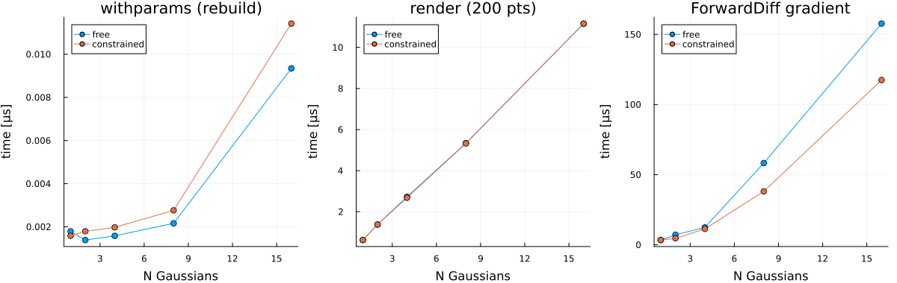
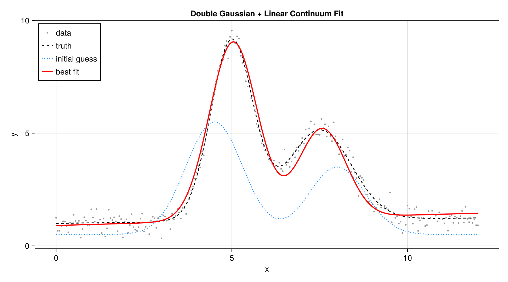
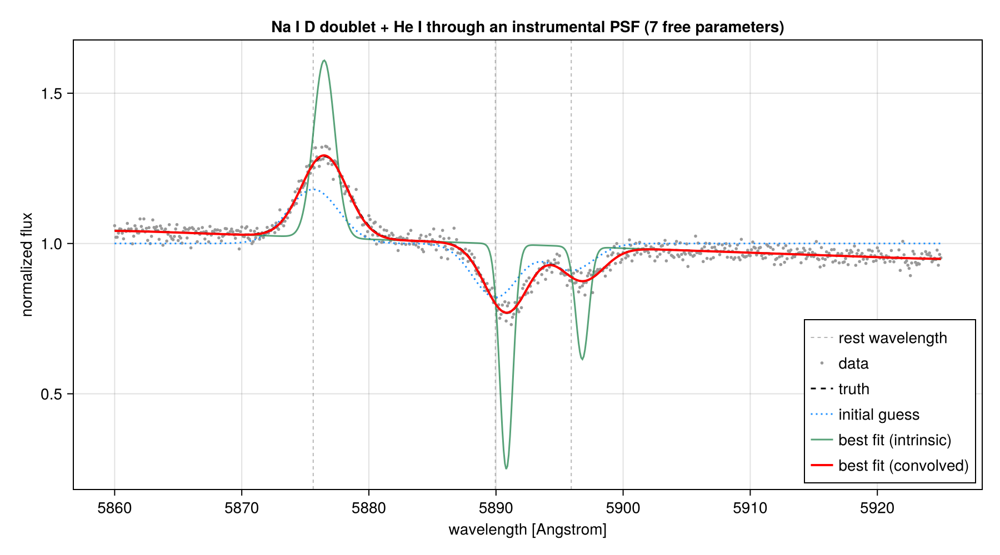
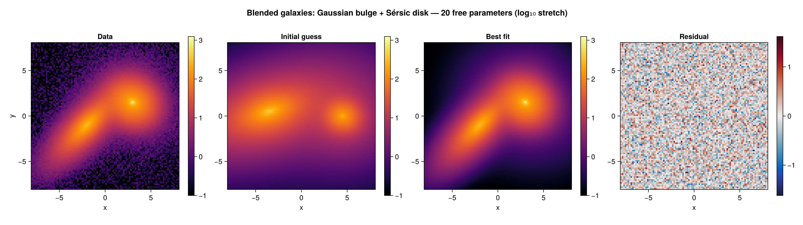
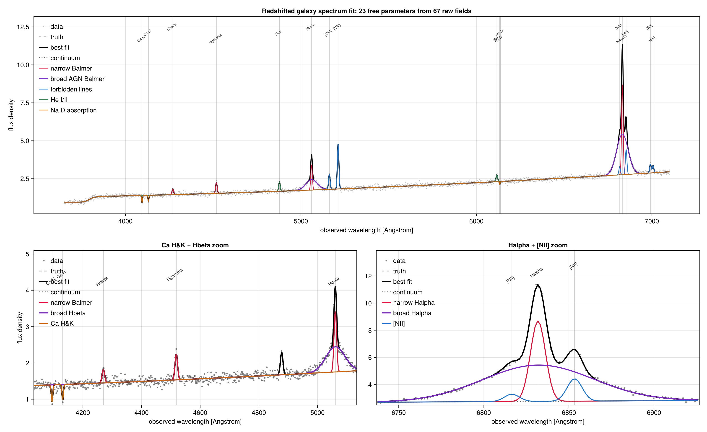
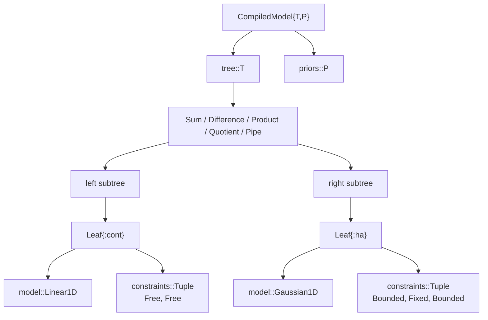

[](https://github.com/fredrikekre/Runic.jl)
[](https://codecov.io/gh/m4ttes4/AstroFit.jl)

# AstroFit

Build, constrain, and fit parametric astrophysical models in Julia.

AstroFit is for workflows where the physics is full of constraints: shared line
centers, tied widths, fixed ratios, bounded amplitudes, reusable components, and
custom model pieces. Handwritten functions with those rules hardcoded are fast,
but they quickly become hard to reuse. AstroFit gives you composable models and
keeps the fitting hot path close to handwritten speed by compiling parameter
scatter and tie resolution into generated, straight-line code.

I started this because I missed the way [Astropy modeling](https://docs.astropy.org/en/stable/modeling/) and [lmfit](https://lmfit.github.io/lmfit-py/) let you snap models together, but I wanted that in Julia where the compiler can actually inline everything. `AccessibleModels` was another reference point for the composable-model idea.

> [!WARNING]
> AstroFit is a working proof of concept, not a
> production-ready package. It works for the workflows I built it for, but the API,
> documentation, and test coverage should still be treated as experimental. I
> wrote and maintain the repository myself, and AI assistance played an important
> role while designing the generated-function internals that make
> `withparams` fast.

- Define reusable model components with clear names.
- Attach physical constraints with `@constrain`.
- Fit with a flat parameter vector through fast `withparams(cm, p)`.
- Extend the system with plain Julia structs and `evaluate` methods.

---

## Installation

```julia
using Pkg
Pkg.add(url="https://github.com/m4ttes4/AstroFit.jl")
```

## Contents

- [Installation](#installation)
- [Motivation](#motivation)
- [Quick Start](#quick-start)
- [Building Models](#building-models)
- [Adding Constraints](#adding-constraints)
- [Working With Parameters](#working-with-parameters)
- [Fitting](#fitting)
- [Optimization.jl Integration](#optimizationjl-integration)
- [Bayesian Sampling](#bayesian-sampling)
- [Future Progress](#future-progress)
- [Benchmarks](#benchmarks)
- [Real Examples](#real-examples)
- [Extending AstroFit](#extending-astrofit)
- [Internal Design](#internal-design)


## Motivation

In astrophysics, parameters are rarely independent: two emission lines share a
velocity width, a doublet has a fixed flux ratio, a redshift shifts the entire
rest-frame model. Constraints are the rule, not the exception.

I kept writing monolithic Julia functions that hardcoded everything. Fast,
but the moment I changed the setup (add a line, drop a constraint) I ended up
rewriting half the code. The alternative is a layer that resolves constraints with
runtime lookups, but then you pay that cost on every fit iteration.

AstroFit tries to sit in the middle: write model components as reusable pieces,
declare constraints explicitly, and let Julia compile the resolved path. The
model stays inspectable and easy to modify, but the inner loop comes down to
`withparams(cm, p)` plus `render`, with no lookups and no overhead.

Models are composed with binary operators (`+`, `*`, `|>`), a pattern common
across fitting libraries because it makes the structure of a model immediately
obvious: `continuum + line_ha + line_nii` reads like what it is. You see the
physics, not the plumbing.


## Quick Start

```julia
using AstroFit
using Optimization, OptimizationOptimJL, ForwardDiff

# 1. Noisy data: an emission line on a flat continuum
λ        = collect(6540.0:0.5:6590.0)
truth    = Const1D(value=1.0) + Gaussian1D(amplitude=5.0, mean=6563.0, sigma=2.0)
observed = render(truth, λ) .+ 0.1 .* randn(length(λ))

# 2. Build a model with a rough initial guess
spec = @model begin
    cont = Const1D(value=0.5)
    ha   = Gaussian1D(amplitude=3.0, mean=6560.0, sigma=3.0)
    cont + ha
end

# 3. Physical constraints: amplitude and width must be positive
@constrain spec begin
    ha.amplitude in (0, Inf)
    ha.sigma     in (0.1, Inf)
end

# 4. Fit: AstroFit builds the problem straight from the model and data
prob = OptimizationProblem(spec, λ, observed)
sol  = solve(prob, Optim.Fminbox(Optim.LBFGS()))

best = withparams(spec, sol.u)   # fitted model: recovers amplitude≈5, mean≈6563, sigma≈2
```

> [!TIP]
> **What happened:**
> - `@model` built a named, composable model tree (`cont + ha`).
> - `@constrain` attached bounds in place, rebinding `spec`.
> - `OptimizationProblem(spec, λ, observed)` read `params(spec)` as the starting point
>   and `bounds(spec)` as the box, automatically.
> - `withparams(spec, sol.u)` rebuilt the fitted model. Print it to see the tree
>   with its final values.


## Building Models

AstroFit models are plain Julia structs. Each one is a single
component (a gaussian, a constant, a power law) and you evaluate it with
`render`:

```julia
g = Gaussian1D(amplitude=3.0, mean=5.0, sigma=1.2)
render(g, 5.0)           # scalar: value at that point
render(g, 0:0.1:10)      # vector: one value per point
```

Every built-in model has keyword arguments with defaults, so you can omit the
ones you don't need:

```julia
c = Const1D(value=2.0)
l = Linear1D(slope=0.3)         # intercept = 0.0 by default
```

### Composing components

Components combine with ordinary operators, no special syntax needed:

| Expression | Meaning |
|------------|---------|
| `a + b` | Sum of two models |
| `a - b` | Difference |
| `a * b` | Product |
| `a / b` | Quotient |
| `a ∘ b` | Pipe: `a(b(x))` |
| `a \|> b` | Pipe: `b(a(x))` |

```julia
# an emission line on a flat continuum
m = Const1D(value=1.0) + Gaussian1D(amplitude=4.0, mean=5.0, sigma=0.5)
render(m, 5.0)   # ≈ 5.0

# an absorption line on a linear continuum
m = Linear1D(slope=0.1, intercept=2.0) - Gaussian1D(amplitude=0.5, mean=3.0, sigma=0.3)
```

This is enough to build and evaluate composite models. But if you want to
**constrain** parameters (fix values, set bounds, tie one parameter to
another) or **fit** the model to data, you need one more step.

### `@model`: giving names to components

Constraints and fitting reference components by name: "fix `ha.mean`",
"tie `line_b.sigma` to `line_a.sigma`". Plain composition like
`Gaussian1D(...) + Const1D(...)` is anonymous: there is no way to point at a
specific component.

`@model` solves this. Each assignment gives a name; the final expression
defines the composition:

```julia
spec = @model begin
    bg     = Linear1D(slope=0.01, intercept=1.0)
    line_a = Gaussian1D(amplitude=6.0, mean=4861.0, sigma=1.5)
    line_b = Gaussian1D(amplitude=2.0, mean=4959.0, sigma=1.5)
    bg + line_a + line_b
end
```

What this does:

- Each `name = Model(...)` creates a named component. The name is how you
  refer to it in `@constrain`, `@fix`, `@tie`, and when inspecting results.
- The last expression (`bg + line_a + line_b`) is the composition.
  A named component left out of it is not part of the model.
- The result is a `CompiledModel`, the object that carries constraints
  and exposes `params`, `bounds`, `withparams`, and the rest of the fitting
  API.
- All parameters start as free (unconstrained). Use `@constrain` to change
  that.

### Inspecting components

After building a model with `@model`, you access any named component as a
property:

```julia
spec.line_a              # the named component :line_a
spec.line_a.model        # Gaussian1D(6.0, 4861.0, 1.5)
spec.line_a.constraints  # constraint on each field: (Free(), Free(), Free())
```

This is how you check values and constraint state at any point: before
fitting, after fitting, or while debugging.

### Points and arrays of points

A model declares how many numbers it takes per point: a 1D model takes a
`Number`, a 2D model an `(x, y)` tuple. `render` takes one point, or an array
whose elements are points, and returns one value per point in the array's shape:

```julia
disk = Gaussian2D(amplitude = 1.0, x0 = 32.0, y0 = 32.0, sigma = 4.0)
img  = zeros(64, 64)
x, y = collect(1.0:64.0), collect(1.0:64.0)
mask = rand(Bool, size(img))

render(g, 5.0)                              # one point
render(g, collect(0:0.1:10))                # a vector of numbers (1D)
render(disk, (32.0, 32.0))                  # one 2D point
render(disk, CartesianIndices(img))         # pixel (i, j) is at (i, j): the first pixel's centre is at 1
render(disk, Coords(x, y))                  # physical axes: a lazy grid, no per-pixel memory
render(disk, CartesianIndices(img)[mask])   # only the valid pixels
out = similar(img)
out .= render.(disk, Coords(x, y))          # in place, no allocation
```

A matrix of numbers is not a set of points: `render(disk, img)` throws and asks
for `CartesianIndices(img)`. Each point is evaluated on its own, so operations
that mix points (convolution with a PSF, rebinning) are not supported yet.


## Adding Constraints

After `@model`, all parameters are free and the optimizer can move any of them.
Constraints lock some down: fix a known wavelength, bound an amplitude to be
positive, tie two line widths so they share the same velocity dispersion.
Each constraint removes a degree of freedom from the fit.

There are four kinds:

| Kind | Meaning | Optimizer slot? |
|------|---------|----------------|
| `Free()` | unconstrained, the optimizer controls it | yes |
| `Bounded(lo, hi)` | free, but confined to `[lo, hi]` | yes |
| `Fixed(v)` | pinned to a constant, never moves | no |
| `Tied(masters, f)` | computed from other free parameters: `f(master₁, …)` | no |

A `Tied` parameter references one or more free (or bounded) masters. Its
value is always derived, never independent, so the optimizer never sees it.
Ties cannot chain: every master must itself be `Free` or `Bounded`.

### `@constrain` blocks

The most common way to add constraints. Inside the block, leaf names are
bare (no `spec.` prefix), and each constraint kind has its own operator:

| Syntax | Constraint | Example |
|--------|-----------|---------|
| `field = value` | Fix to a constant | `line_a.mean = 4861.0` |
| `field in (lo, hi)` | Bound to an interval | `line_a.amplitude in (0, Inf)` |
| `field -> expr` | Tie to other parameters | `line_b.sigma -> line_a.sigma` |
| `field ~ dist` | Bayesian prior | `line_a.sigma ~ LogNormal(0, 0.5)` |
| `field` (bare) | Fix at current value | `line_a.mean` |
| `@free field` | Release back to free | `@free line_a.mean` |

```julia
@constrain spec begin
    line_a.mean       = 4861.0              # fix: known Hβ wavelength
    line_b.mean       = 4959.0              # fix: known [OIII] wavelength
    line_a.amplitude  in (0, Inf)           # bound: emission only
    line_b.amplitude  in (0, Inf)
    line_b.sigma      -> line_a.sigma       # tie: same velocity width
end

nfree(spec)        # 5
paramnames(spec)   # [:bg_slope, :bg_intercept, :line_a_amplitude, :line_a_sigma, :line_b_amplitude]
```

After `@constrain`, the display updates to reflect
the constraints: fixed values turn red, bounds show their interval, tied parameters
show their master:

```
julia> spec   # after @constrain
CompiledModel  3 free  2 bounds  2 fixed  1 tied
formula: bg + line_a + line_b
+
├─ bg :: Linear1D
│  ├─ slope      0.01      free
│  └─ intercept  1.0       free
├─ line_a :: Gaussian1D
│  ├─ amplitude  6.0       bounds [0.0, Inf]
│  ├─ mean       4861.0    fixed
│  └─ sigma      1.5       free
└─ line_b :: Gaussian1D
   ├─ amplitude  2.0       bounds [0.0, Inf]
   ├─ mean       4959.0    fixed
   └─ sigma      1.5       tied -> line_a.sigma
```

> [!NOTE]
> A `@constrain` block states the model's **full** constraint set: every
> parameter not mentioned is reset to its default first, so re-running an edited
> block (e.g. in the REPL) never leaves a stale constraint behind. The default is
> `Free` (`Fixed` for `AbstractKernel` fields, which are calibration inputs).
> Priors are exempt from the reset — they persist across blocks until overwritten.
> Constraining the same parameter twice in one block is a compile-time error, no
> silent overwrites. Priors are the exception: two `~` lines on the same
> parameter are allowed and the last one wins.

### Tie expressions

The right-hand side of a tie is not limited to another parameter. It can be
any Julia expression: every `leaf.field` path it references becomes a master
parameter, and everything else — arithmetic, function calls, including
functions you wrote yourself — is kept as-is and evaluated when `withparams`
rebuilds the model:

```julia
blend(a1, a2) = 0.5 * (a1 + a2)   # any user-defined function works

@constrain spec begin
    line_b.sigma     -> line_a.sigma                           # share the same value
    line_b.mean      -> line_a.mean + 98.0                     # numeric relation
    line_b.amplitude -> blend(line_a.amplitude, bg.intercept)  # user function, several masters
end
```

However many masters a tie references, they must all be free or bounded
parameters, and the tied parameter still consumes no optimizer slot.

### Standalone constraint macros

For quick one-off edits outside a block, each macro targets one parameter
and automatically rebinds the model variable:

```julia
@fix   spec.line_a.mean = 4861.0                          # pin to a value
@bound spec.line_a.amplitude in (0, Inf)                   # set bounds
@tie   spec.line_b.sigma -> spec.line_a.sigma              # tie to another parameter
@free  spec.line_a.mean                                    # release back to free
@prior spec.line_a.sigma ~ LogNormal(0.0, 0.5)             # attach a Bayesian prior
```

Note: standalone macros use the full path (`spec.line_a.field`), while
`@constrain` uses bare names (`line_a.field`).

### Programmatic constraints with `setconstraint`

The macros lower to `setconstraint`, which you can call directly when
building constraints in a loop or from data:

```julia
s = setconstraint(spec, :line_a, :sigma, Bounded(0.5, 10.0))
s = setconstraint(s, :line_b, :sigma, Tied(((:line_a, :sigma),), identity))
validate(s)   # checks all ties point at free masters; throws otherwise
```


## Working With Parameters

### Free parameters

```julia
nfree(spec)        # number of free (+ bounded) parameters
params(spec)       # current free values (p₀ for the optimizer)
paramnames(spec)   # slot labels: [:bg_slope, :bg_intercept, :line_a_amplitude, …]
bounds(spec)       # (lower, upper) vectors aligned with params
```

All four accessors walk the tree in the same left-to-right order
`withparams` uses to assign slots, so they always line up.

### Rebuilding with `withparams`

```julia
model = withparams(spec, params(spec))
```

`withparams` scatters the flat parameter vector into the free positions,
re-resolves all tied parameters, and returns a new `CompiledModel` with the
updated values (constraints and priors carried over), so the result is
navigable (`model.line_a.model`), renderable, and re-fittable just like the
original. This is the function you call inside the fitting loop.

For example, if `line_b.sigma -> line_a.sigma`, the optimizer never sees a
separate `line_b_sigma` slot. `withparams` rebuilds a model where that
field has already been computed from `line_a_sigma`, so `render` does not
need to know about constraints.

---

## Fitting

AstroFit provides a built-in likelihood layer through `ObjectiveFunction`, which
powers the package extensions for Optimization.jl and the
[Bayesian sampling](#bayesian-sampling) layer. You can also write a plain loss
function by hand.

### ObjectiveFunction

`ObjectiveFunction(cm, points, y, err; statistic)` bundles a model with data.
`points` follows the same rules as `render` (a vector for 1D, `CartesianIndices(img)`,
`Coords(x, y)`, …), and a masked fit is `CartesianIndices(img)[mask]` against
`img[mask]`. The
default statistic is `chi2`; other options are `loglikelihood`,
`negloglikelihood`, `logposterior`, and `neglogposterior` (plain functions, all
exported).

```julia
λ   = collect(4840.0:0.5:4980.0)
y   = render(withparams(spec, params(spec)), λ) .+ 0.1 .* randn(length(λ))
err = fill(0.1, length(λ))

obj = ObjectiveFunction(spec, λ, y, err)          # chi2 by default
obj(params(spec))                                  # evaluate at current params
```

It is fully differentiable, gradient-based optimizers and AD work out of the
box:

```julia
using ForwardDiff
ForwardDiff.gradient(obj, params(spec))
```

For Bayesian sampling, use a log-density statistic (see
[Bayesian Sampling](#bayesian-sampling)):

```julia
obj_bayes = ObjectiveFunction(spec, λ, y, err; statistic = logposterior)
```

### Statistics as functions

Each statistic is also a plain function `(f::ObjectiveFunction, p) -> Real`, so
you are not limited to the one picked by `statistic`. All of them are exported:
`chi2`, `loglikelihood`, `negloglikelihood`, `logposterior`, `neglogposterior`.

```julia
chi2(obj, params(spec))              # regardless of obj's configured statistic
loglikelihood(obj_bayes, params(spec))
```

This is the same shape a custom statistic needs, so writing your own (e.g.
Poisson counts instead of Gaussian errors) is just another function with this
signature:

```julia
function poisson_ll(f::ObjectiveFunction, p)
    model = withparams(f.cm, p)
    counts = render(model, f.points)
    sum(logpdf.(Poisson.(counts), f.y))
end

obj = ObjectiveFunction(spec, λ, y; statistic = poisson_ll)
```

### Manual loss function

If you need a custom objective (e.g. Cash statistic, regularisation), build it
directly from `withparams` + `render`:

```julia
loss(p) = sum(abs2, render(withparams(spec, p), λ) .- y)
```


## Optimization.jl Integration

AstroFit ships a package extension for
[Optimization.jl](https://github.com/SciML/Optimization.jl). Loading
`Optimization` and `ForwardDiff` together activates it, no extra import needed.

First, some synthetic data to work with:

```julia
using AstroFit

λ = collect(-5.0:0.1:5.0)
true_model = Const1D(1.0) + Gaussian1D(5.0, 0.0, 1.0)
y = render(true_model, λ) .+ 0.01 .* randn(length(λ))
```

Now build a model with an initial guess, add constraints, and fit:

```julia
using Optimization, ForwardDiff, OptimizationOptimJL

spec = @model begin
    cont = Const1D(0.5)
    line = Gaussian1D(3.0, 0.2, 1.5)
    cont + line
end

@constrain spec begin
    line.amplitude in (0, Inf)
    line.sigma     in (0.1, Inf)
end

prob = OptimizationProblem(spec, λ, y)
sol  = solve(prob, LBFGS())

best = withparams(spec, sol.u)
```

`OptimizationProblem(spec, λ, y)` extracts `params(spec)` as the starting point
and `bounds(spec)` as `lb`/`ub` automatically. If no parameter is bounded, the
box is omitted so unconstrained solvers (BFGS, NelderMead) work directly.

If you need to control the AD backend or build the problem manually, use
`OptimizationFunction` instead:

```julia
optf   = OptimizationFunction(spec, λ, y; adtype = AutoForwardDiff())
lb, ub = bounds(spec)
prob   = OptimizationProblem(optf, params(spec); lb, ub)
```


## Bayesian Sampling

Bayesian analysis does not require a different model layer. Mechanical
constraints (fixes, ties, bounds) reduce the dimensionality as usual, and
priors attached with `~` turn the likelihood into a posterior. The same flat
parameter vector the optimizer sees is what the sampler sees.

### Priors

Priors are ordinary `Distributions.jl` objects, attached in `@constrain` with
`~`, or one at a time with the standalone `@prior` macro. They apply to free
parameters only — a tied or fixed parameter has no slot, so it needs no prior:

```julia
using Distributions

@constrain spec begin
    line.amplitude ~ Uniform(0.0, 15.0)
    line.sigma     ~ truncated(LogNormal(0.0, 0.5); lower = 0.1)
end

# equivalent one-off form (full path, like the other standalone macros):
# @prior spec.line.sigma ~ truncated(LogNormal(0.0, 0.5); lower = 0.1)
```

The Bayesian entry point is `logposterior = loglikelihood + logprior`, already
available as a statistic:

```julia
obj = ObjectiveFunction(spec, λ, y, err; statistic = logposterior)
```

Note that the log-density does **not** auto-reject out-of-support points: if a
parameter must stay in a range, use a bounded prior (`Uniform`,
`truncated(...)`) so the posterior is `-Inf` outside it.

> [!IMPORTANT]
> Priors are all-or-nothing: as soon as the model has one prior, building an
> `ObjectiveFunction` from it requires **every** free parameter to have one,
> and throws at construction time otherwise. There is no implicit fallback —
> bounds are not priors, and a missing prior never silently contributes 0.

### Sampling via LogDensityProblems

An `ObjectiveFunction` implements the
[LogDensityProblems.jl](https://github.com/tpapp/LogDensityProblems.jl)
interface, the standard Julia abstraction for log-density targets. Any sampler
that accepts a LogDensityProblems target should therefore be compatible —
AdvancedHMC.jl, DynamicHMC.jl, Pigeons.jl, and the rest of that ecosystem.
NUTS is shown here as the reference example.

[AdvancedHMC.jl](https://github.com/TuringLang/AdvancedHMC.jl) provides NUTS.
Being gradient-based, it needs the target wrapped with an AD backend via
[LogDensityProblemsAD.jl](https://github.com/tpapp/LogDensityProblemsAD.jl):

```julia
using AdvancedHMC, AbstractMCMC, LogDensityProblemsAD, ForwardDiff

ℓ = ADgradient(:ForwardDiff, obj)
chain = AbstractMCMC.sample(
    AbstractMCMC.LogDensityModel(ℓ), NUTS(0.8), 1500;
    n_adapts = 500, discard_initial = 500, initial_params = params(spec),
)
```

[Pigeons.jl](https://github.com/Julia-Tempering/Pigeons.jl) (parallel
tempering) additionally has its own AstroFit extension: when both packages are
loaded, the chain initialization and the reference distribution are derived
from the model's priors, and the objective is the target as-is:

```julia
using Pigeons

pt      = pigeons(target = obj, record = [traces; record_default()])
samples = sample_array(pt)     # (samples, params + logdensity, chains)
```

The resulting chains are plain sample arrays, so the usual MCMC ecosystem
applies: MCMCChains.jl for summaries and diagnostics (pass
`chain_type = Chains, param_names = string.(paramnames(spec))` to `sample` to
get a `Chains` object directly), PairPlots.jl for corner plots, and so on.


## Future Progress

### A `@component` macro for defining models

The main thing I want to add is a macro for defining new model components. Right
now, bringing your own model means writing the full boilerplate by hand: the
`@kwdef struct` with one type parameter per field, and an `evaluate` method (see
[Extending AstroFit](#extending-astrofit)). It is not hard, but it is the same
blocks every time, and it is the steepest part of the learning curve. I want
that barrier gone.

The idea is to let you declare a component from a single formula:

```julia
@component Gaussian1D(x; amplitude=1.0, mean=0.0, sigma=1.0) =
    amplitude * exp(-((x - mean) / sigma)^2 / 2)

@component Moffat1D(x; amplitude=1.0, mean=0.0, alpha=1.0, beta=1.0) =
    amplitude * (1 + ((x - mean) / alpha)^2)^(-beta)
```

The coordinates come before the semicolon, the parameters (with their defaults)
after it. From that one line the macro would generate everything the model
protocol needs: the `@kwdef struct <: AbstractModel{1, 1}` with one `<:Real`
type parameter per field (the number of coordinates before the semicolon is the
input arity), and the `evaluate` method (rewriting each bare parameter name into
a field access on the model).

The `Gaussian1D` line above expands to exactly what the built-in zoo models
already are, so it drops straight into `@model`, `@constrain`, and the fitting
path:

```julia
Base.@kwdef struct Gaussian1D{A<:Real, M<:Real, S<:Real} <: AbstractModel{1, 1}
    amplitude::A = 1.0
    mean::M = 0.0
    sigma::S = 1.0
end
AstroFit.evaluate(m::Gaussian1D, x::Number) =
    m.amplitude * exp(-((x - m.mean) / m.sigma)^2 / 2)
```


## Benchmarks

The benchmark asks one specific question:

> If a model has physical constraints, how much slower is AstroFit than the
> hand-written Julia function you would write for maximum speed?

```julia
render(withparams(cm, p), x)      # AstroFit
handwritten_constrained(p, x)     # hardcoded baseline
```

The hand-written baseline has no abstraction cost: the fixed values, bounds, and
ties are baked directly into the function body. AstroFit keeps the reusable model
representation, but resolves ties through compiled straight-line code rather than
runtime lookup.



The answer is essentially zero overhead, and it holds as the model grows. The
plot sweeps `N` Gaussians (2 to 64) where every amplitude past the first is tied
to the first, compared against a handwritten baseline over 400 points:

| N | free params | AstroFit | Handwritten | ratio |
|---|---|---|---|---|
| 2   |   5 |   2.6 µs |   2.8 µs | 0.95x |
| 8   |  17 |  10.2 µs |  10.5 µs | 0.97x |
| 32  |  65 |  40.4 µs |  41.3 µs | 0.98x |
| 64  | 129 |  99.7 µs | 101.1 µs | 0.99x |

Every ratio sits at or below 1.0. 
AstroFit never costs more than the
handwritten version. (That's the goal)

`withparams` is `@generated`: scattering `p` into the model and resolving ties
happens at compile time. What runs is unrolled straight-line code that builds
immutable structs, no loops, no dictionary lookup, no dispatch. It stays
allocation-free and tiny even with 63 ties (56 ns at N=64). The render itself
is dominated by `exp` calls, which both versions pay identically.

### Full fitting stack: Hα + [NII] triplet

The scaling benchmark measures render cost in isolation. A fairer question is
what happens through the whole fitting stack: chi2, gradients, optimization.

The test is an Hα + [NII] triplet: linear continuum + three Gaussians, [NII]
amplitudes and means tied to Hα by atomic physics ratios, all sigmas shared.
5 free parameters, 1000 points. The handwritten baseline is a scalar
`@inbounds` loop with ties hardcoded, the kind of thing you'd write for speed.

|                | AstroFit       | Handwritten     | Ratio        |
|----------------|----------------|-----------------|--------------|
| render         | 10.8 µs        | 13.5 µs         | 0.80x        |
| chi2           | 11.2 µs        | 13.6 µs         | 0.82x        |
| gradient       | 22.8 µs        | 28.8 µs         | 0.79x        |
| optimization   | 36.5 ms        | 43.7 ms         | 0.84x        |

AstroFit is faster on every row. `withparams` rebuilds the struct tree with
`Dual` numbers on every gradient call, but that is a handful of straight-line
constructions; what matters is the per-point loop. Every model's `evaluate` is
inlined into it, so each point is one straight-line expression. (Without the
inlining the gradient measured 1.17x or 1.38x depending on the run: a call left
in the hot loop makes timing depend on where the JIT places the code.)

See [`bench/astrofit_vs_handwritten.jl`](bench/astrofit_vs_handwritten.jl) for
the full benchmark script.


## Real Examples

Full working scripts are in the [`examples/`](examples/) directory.

### Double Gaussian + linear continuum (1D)

Two emission lines on a sloped continuum, fitted to synthetic noisy data. The
second Gaussian's width and amplitude are tied to the first (`g2.sigma -> g1.sigma`,
`g2.amplitude -> 0.5 * g1.amplitude`), reducing 8 model parameters to 6 free ones.

```julia
cm = @model begin
    cont = Linear1D(slope = 0.0, intercept = 0.5)
    g1   = Gaussian1D(amplitude = 5.0, mean = 4.5, sigma = 0.8)
    g2   = Gaussian1D(amplitude = 3.0, mean = 8.0, sigma = 0.8)
    cont + g1 + g2
end

@constrain cm begin
    g2.sigma     -> g1.sigma
    g2.amplitude -> 0.5 * g1.amplitude
end
```



See [`examples/main/double_gaussian_fit.jl`](examples/main/double_gaussian_fit.jl) for the
full script.

### Na I D absorption doublet + He I (1D)

The Na I D doublet in absorption plus a He I emission line on a sloped
continuum. Every tie has a physical reason: the doublet separation is atomic
physics (free systemic velocity, fixed splitting), the depth ratio is the
optically thin 2:1, the two Na lines share one width because they come from the
same gas, and He I is tied to the same systemic velocity but keeps its own width
since it is a different gas.

```julia
cm = @model begin
    cont = Linear1D(slope = 0.0, intercept = 1.0)
    d2   = Gaussian1D(amplitude = -0.4, mean = L_NAD_D2, sigma = 0.8)
    d1   = Gaussian1D(amplitude = -0.2, mean = L_NAD_D1, sigma = 0.8)
    hei  = Gaussian1D(amplitude = 0.3, mean = L_HEI, sigma = 1.2)
    cont + d2 + d1 + hei
end

@constrain cm begin
    d1.amplitude -> 0.5 * d2.amplitude             # optically thin 2:1
    d1.mean      -> d2.mean + (L_NAD_D1 - L_NAD_D2) # atomic separation
    d1.sigma     -> d2.sigma                       # same gas
    hei.mean     -> d2.mean + (L_HEI - L_NAD_D2)   # same systemic velocity
    # ... bounds on amplitudes, widths, and line position
end
```



See [`examples/main/na_doublet_fit.jl`](examples/main/na_doublet_fit.jl) for
the full script.

### Blended galaxies bulge+disk decomposition (2D)

Two partially overlapping galaxies, each decomposed into a Gaussian bulge and an
exponential disk. Within each galaxy, the bulge center and position angle are tied to the
disk. 20 free parameters total.

```julia
cm = @model begin
    bulge1 = Gaussian2D(amplitude = 20.0, 
                        x0 = -3.5, 
                        y0 = 0.5, 
                        sigma = 2.5, 
                        q = 1.0, 
                        theta = 0.0)

    disk1  = Sersic2D(amplitude = 8.0, 
                    x0 = -3.5, 
                    y0 = 0.5, 
                    r_eff = 5.0, 
                    n = 1.0, 
                    q = 0.9, 
                    theta = 0.0)

    bulge2 = Gaussian2D(amplitude = 15.0, 
                        x0 = 4.5, 
                        y0 = 0.0, 
                        sigma = 1.5, 
                        q = 1.0, 
                        theta = 0.0)

    disk2  = Sersic2D(amplitude = 5.0, 
                    x0 = 4.5, 
                    y0 = 0.0, 
                    r_eff = 4.5, 
                    n = 1.0, 
                    q = 0.9, 
                    theta = 0.0)
                    
    bulge1 + disk1 + bulge2 + disk2
end

@constrain cm begin
    disk1.n in (0.5, 6.0)
    disk2.n in (0.5, 6.0)
    bulge1.x0    -> disk1.x0
    bulge1.y0    -> disk1.y0
    bulge1.theta -> disk1.theta
    bulge2.x0    -> disk2.x0
    bulge2.y0    -> disk2.y0
    bulge2.theta -> disk2.theta
    # ... bounds on amplitudes, sizes, q, theta
end
```



See [`examples/main/blended_galaxies_fit.jl`](examples/main/blended_galaxies_fit.jl) for
the full script.

### Redshifted galaxy spectrum flagship fit (1D)

This is the kind of fit I built AstroFit for. The spectrum is a synthetic AGN
host-galaxy covering the Balmer break/Hα window, the region where you typically
have the most going on at once: a stellar power law with a Balmer break, an AGN
power law, a multiplicative dust screen, Ca II K/H stellar absorption, narrow
Balmer emission from the host (Hδ, Hγ, Hβ, Hα), broad Balmer components from the
AGN, forbidden-line doublets ([OIII] 4959/5007, [NII] 6548/6583, [SII]
6716/6731), He II and He I, Na D absorption, and a redshift that moves everything
to the observer frame.

The model has 67 raw parameters, but most of them aren't independent. Doublet
ratios like [OIII] and [NII] are set by atomic physics, Hβ and the higher Balmer
lines are tied to Hα through the Balmer decrement, all narrow lines share one
velocity width, broad lines share another, and rest wavelengths don't move. Once
you write those constraints down, only 23 parameters are actually free.

`DustScreen1D` and `BalmerBreak1D` are custom components defined in the example
script itself (see [Extending AstroFit](#extending-astrofit)), not built-ins;
`RedshiftAxis1D` is the script's own copy of the built-in `Redshift1D`:

```julia
cm = @model begin
    stellar = PowerLaw1D(norm = pl_norm, x_ref = L_REF, index = pl_index)
    bbreak  = BalmerBreak1D(jump = break_jump, width = 15.0, lambda_break = L_BREAK)
    agn     = PowerLaw1D(norm = agn_norm, x_ref = L_REF, index = agn_index)
    dust    = DustScreen1D(a_v = dust_av, lambda_ref = L_REF, slope = dust_slope)

    cak    = Gaussian1D(amplitude = cak_amplitude, mean = L_CAK, sigma = ca_sigma)
    cah    = Gaussian1D(amplitude = cah_amplitude, mean = L_CAH, sigma = ca_sigma)
    hdelta = Gaussian1D(amplitude = 0.256 * ha_amplitude / 2.86, mean = L_HD, sigma = narrow_sigma)
    hgamma = Gaussian1D(amplitude = 0.466 * ha_amplitude / 2.86, mean = L_HG, sigma = narrow_sigma)

    hbeta       = Gaussian1D(amplitude = ha_amplitude / 2.86, mean = L_HB, sigma = narrow_sigma)
    broad_hbeta = Gaussian1D(amplitude = broad_ha_amplitude / 3.1, mean = L_HB, sigma = broad_sigma)
    heii        = Gaussian1D(amplitude = heii_amplitude, mean = L_HEII, sigma = narrow_sigma)
    oiii_b      = Gaussian1D(amplitude = oiii_blue_amplitude, mean = L_OIII_B, sigma = narrow_sigma)
    oiii_r      = Gaussian1D(amplitude = 2.98 * oiii_blue_amplitude, mean = L_OIII_R, sigma = narrow_sigma)

    hei      = Gaussian1D(amplitude = hei_amplitude, mean = L_HEI, sigma = narrow_sigma)
    ha       = Gaussian1D(amplitude = ha_amplitude, mean = L_HA, sigma = narrow_sigma)
    broad_ha = Gaussian1D(amplitude = broad_ha_amplitude, mean = L_HA, sigma = broad_sigma)
    nii_b    = Gaussian1D(amplitude = nii_blue_amplitude, mean = L_NII_B, sigma = narrow_sigma)
    nii_r    = Gaussian1D(amplitude = 3.06 * nii_blue_amplitude, mean = L_NII_R, sigma = narrow_sigma)
    sii_b    = Gaussian1D(amplitude = sii_blue_amplitude, mean = L_SII_B, sigma = narrow_sigma)
    sii_r    = Gaussian1D(amplitude = sii_red_amplitude, mean = L_SII_R, sigma = narrow_sigma)

    nad_d2 = Gaussian1D(amplitude = nad_d2_amplitude, mean = L_NAD_D2, sigma = nad_sigma)
    nad_d1 = Gaussian1D(amplitude = 0.65 * nad_d2_amplitude, mean = L_NAD_D1, sigma = nad_sigma)

    redshift = RedshiftAxis1D(z = z)

    (
        dust * (
            bbreak * stellar + agn + cak + cah + hdelta + hgamma +
                hbeta + broad_hbeta + heii + oiii_b + oiii_r + hei + ha +
                broad_ha + nii_b + nii_r + sii_b + sii_r + nad_d2 + nad_d1
        )
    ) ∘ redshift
end

@constrain cm begin
    stellar.x_ref                                   # fixed: reference wavelength
    bbreak.width
    bbreak.lambda_break
    agn.x_ref
    dust.lambda_ref

    cah.sigma -> cak.sigma                          # same stellar absorption width
    hdelta.amplitude -> 0.256 * ha.amplitude / 2.86 # Balmer decrement
    hdelta.sigma -> ha.sigma
    hgamma.amplitude -> 0.466 * ha.amplitude / 2.86
    hgamma.sigma -> ha.sigma
    hbeta.amplitude -> ha.amplitude / 2.86
    hbeta.sigma -> ha.sigma
    broad_hbeta.amplitude -> broad_ha.amplitude / 3.1
    broad_hbeta.sigma -> broad_ha.sigma

    heii.sigma -> ha.sigma                          # one narrow velocity width
    hei.sigma -> ha.sigma
    oiii_b.sigma -> ha.sigma
    oiii_r.amplitude -> 2.98 * oiii_b.amplitude     # atomic doublet ratios
    oiii_r.sigma -> ha.sigma
    nii_b.sigma -> ha.sigma
    nii_r.amplitude -> 3.06 * nii_b.amplitude
    nii_r.sigma -> ha.sigma
    sii_b.sigma -> ha.sigma
    sii_r.sigma -> ha.sigma
    nad_d1.amplitude -> 0.65 * nad_d2.amplitude
    nad_d1.sigma -> nad_d2.sigma

    # ... every rest wavelength fixed, plus bounds on the continuum,
    #     narrow/broad line amplitudes, widths, and the redshift
end
```

> [!NOTE]
> Please note that this example is not meant to represent a physically realistic spectrum
> it packs in every kind of constraint the library supports (fixes, bounds, ties, coordinate transforms) mostly to show how far the composition and
> constraint system stretches on a single model



See [`examples/main/complex_galaxy_spectrum_fit.jl`](examples/main/complex_galaxy_spectrum_fit.jl)
for the full script.

---

## Extending AstroFit

The built-in models cover the most common shapes (gaussians, lorentzians,
power laws, polynomials) but sooner or later you'll need something specific:
a dust extinction curve, a blackbody, a custom line profile, a coordinate
transform. AstroFit is designed for this: any Julia struct can become a model
component, and it takes two things.

### Step 1: define a struct

Your struct subtypes `AbstractModel{I, O}` and holds its parameters as fields.
`I` is how many numbers the model takes per point and `O` how many it returns:
a spectrum is `AbstractModel{1, 1}`, an image `AbstractModel{2, 1}`, a coordinate
transform of the plane `AbstractModel{2, 2}`. Use `@kwdef` so you get keyword
constructors for free:

```julia
Base.@kwdef struct Blackbody1D{T1<:Real, T2<:Real} <: AbstractModel{1, 1}
    temperature::T1 = 5000.0
    norm::T2        = 1.0
end
```

Two things to watch. Each fittable field gets **its own** type parameter, and
each of those parameters should be `<:Real`, not `Float64`. ForwardDiff works by
passing dual numbers through your model, so a hardcoded `Float64` breaks
gradient-based fitting.

The per-field parameter matters just as much. AstroFit rebuilds a model field by
field, and during differentiation a free field arrives as a dual number while a
fixed one keeps its `Float64` value — so the fields will not always agree on a
type. Share one parameter across two fields and the model works until the user
fixes one of them, then fails with a `MethodError` from inside a gradient.

#### What a field is

Nothing is coerced: **each field keeps whatever type it is given**, and is
carried through reconstruction untouched.

> Declare a field with its own `<:Real` parameter if you might ever want to fit
> it. Give it a concrete type (`Int`, `Bool`, `Symbol`, an array) if it is an
> internal value.

```julia
struct TemplateLine{A<:Real, S<:Real, V<:AbstractVector} <: AbstractModel{1, 1}
    amplitude::A      # fittable — its own parameter, holds duals
    shift::S          # fittable — its own parameter, independent of amplitude
    template::V       # internal — a measured profile is data, not a parameter
    halfwidth::Int    # internal — a count in samples
    normalize::Bool   # internal — a flag
    edge::Symbol      # internal — an edge policy
end
```

An internal field of any type needs no special handling — a gradient-based
optimizer was never going to perturb a `Symbol` or an `Int`, and since nothing
is promoted, nothing tries to turn one into a dual number.

### Step 2: define `evaluate`

`evaluate` takes your model and one point, and returns the model value there.
It is not exported, so extend it qualified:

```julia
function AstroFit.evaluate(m::Blackbody1D, λ::Number)
    h, c, k = 6.626e-27, 2.998e10, 1.381e-16   # CGS
    ν = c / (λ * 1e-8)                           # Å → cm → Hz
    m.norm * 2h * ν^3 / c^2 / (exp(h * ν / (k * m.temperature)) - 1)
end
```

The point argument (`λ`, `x`, `ν`, whatever makes sense) must accept `Number`,
not just `Float64`, again for the same AD reason. Users never call `evaluate`:
they call `render`, which checks that the point and the returned value match
the declared `I` and `O` and names your model when they don't. That's it, your
model is ready.

### Using it

Once defined, your model works exactly like a built-in one. You can compose it,
name it, constrain it, and fit it:

```julia
spec = @model begin
    bb   = Blackbody1D(temperature = 6000.0, norm = 1e-10)
    line = Gaussian1D(amplitude = 5.0, mean = 6563.0, sigma = 2.0)
    bb + line
end

@constrain spec begin
    bb.temperature in (3000, 30000)
    line.mean
end
```

### Coordinate transforms

Not every model produces flux. Some transform coordinates: a redshift, a
velocity offset, a wavelength-to-energy conversion. They are `1 => 1` models
too, and work through composition with `∘`:

```julia
Base.@kwdef struct Doppler1D{T<:Real} <: AbstractModel{1, 1}
    v::T = 0.0                                 # km/s
end

AstroFit.evaluate(m::Doppler1D, λ::Number) = λ / (1 + m.v / 299792.458)
```

When you write `line ∘ shift`, AstroFit evaluates the right side first
(transforming the coordinate), then passes the result to the left side. So
`Gaussian1D(...) ∘ Doppler1D(v = 300.0)` evaluates the gaussian at the
rest-frame wavelength:

```julia
spec = @model begin
    line  = Gaussian1D(1.0, 5000.0, 10.0)
    shift = Doppler1D(v = 300.0)
    line ∘ shift
end
```

### Precomputed constants: `_cache_`

`evaluate` runs once per point, so work that depends only on the parameters
(a reciprocal, a `sincos`, a profile width) is best done once. Store it in a last
field named `_cache_`, computed by an inner positional constructor:

```julia
struct Lorentz1D{A<:Real, X<:Real, W<:Real, K} <: AbstractModel{1, 1}
    amplitude::A
    x0::X
    fwhm::W
    _cache_::K
    function Lorentz1D(amplitude::A, x0::X, fwhm::W) where {A<:Real, X<:Real, W<:Real}
        c = (hw2 = (fwhm / 2)^2,)
        return new{A, X, W, typeof(c)}(amplitude, x0, fwhm, c)
    end
end
Lorentz1D(; amplitude = 1.0, x0 = 0.0, fwhm = 1.0) = Lorentz1D(amplitude, x0, fwhm)

AstroFit.evaluate(m::Lorentz1D, x::Number) =
    m.amplitude * m._cache_.hw2 / ((x - m.x0)^2 + m._cache_.hw2)
```

The rules:

- `_cache_` must be the **last** field; AstroFit throws otherwise.
- It is not a parameter: it gets no optimizer slot and no constraint.
- `withparams` calls the positional constructor with every other field in
  order, so the cache is recomputed whenever the parameters change, and its
  type follows theirs (dual numbers flow through it). `@kwdef` cannot express
  this, so write the keyword constructor by hand.

The built-in `Voigt1D` and 2D models work this way; see
[`src/zoo/models2d.jl`](src/zoo/models2d.jl).

### A 2D model

A 2D model declares `AbstractModel{2, 1}` and takes its point as a tuple:

```julia
struct ExpDisk2D{A<:Real, X<:Real, Y<:Real, H<:Real} <: AbstractModel{2, 1}
    amplitude::A
    x0::X
    y0::Y
    h::H
end
AstroFit.evaluate(m::ExpDisk2D, (x, y)::NTuple{2, Number}) =
    m.amplitude * exp(-hypot(x - m.x0, y - m.y0) / m.h)
```

`NTuple{2, Number}` accepts mixed element types, such as an `Int` pixel index
beside a dual number. It renders on every array of points described in
[Points and arrays of points](#points-and-arrays-of-points): `CartesianIndices(img)`
for pixels, `Coords(x, y)` for physical axes, a masked subset, or a vector of
tuples.

---

## Internal Design

### Structure

`CompiledModel` has two fields:

- `tree`: one annotated model tree.
- `priors`: optional statistical priors, stored separately from mechanical constraints.

The tree is built from the same compound operator nodes used by ordinary models
(`Sum`, `Difference`, `Product`, `Quotient`, `Pipe`). The leaves are
`Leaf{name}` wrappers. Each leaf stores the user component and a tuple of
constraints aligned with that component's fields.


```mermaid
flowchart TB
    CM["CompiledModel{T,P}"]
    CM --> TREE["tree::T"]
    CM --> PRIORS["priors::P"]

    TREE --> SUM["Sum / Difference / Product / Quotient / Pipe"]
    SUM --> LEFT["left subtree"]
    SUM --> RIGHT["right subtree"]

    LEFT --> LEAF1["Leaf{:cont}"]
    RIGHT --> LEAF2["Leaf{:ha}"]

    LEAF1 --> MODEL1["model::Linear1D"]
    LEAF1 --> CONS1["constraints::Tuple<br/>Free, Free"]

    LEAF2 --> MODEL2["model::Gaussian1D"]
    LEAF2 --> CONS2["constraints::Tuple<br/>Bounded, Fixed, Bounded"]
```

For a model like:

```julia
spec = @model begin
    cont = Linear1D(0.0, 1.0)
    ha   = Gaussian1D(5.0, 6563.0, 2.0)
    cont + ha
end
```

the stored tree is conceptually:

```text
CompiledModel
└─ tree = Sum(
       Leaf{:cont}(Linear1D(...), (Free(), Free())),
       Leaf{:ha}(Gaussian1D(...), (Free(), Free(), Free())),
   )
```

After constraints, only the leaf constraint tuples change; the algebraic tree
shape does not need a parallel specification object. This is the main invariant:
the model values and constraint metadata live in one structure, so there is no
separate registry/spec tree that can drift out of sync.

### Parameter Slots

`params`, `bounds`, and `paramnames` all walk the annotated tree in the same
left-to-right order:

1. Visit the left subtree before the right subtree.
2. Inside each leaf, visit fields in the order defined by the model struct.
3. Count only `Free` and `Bounded` fields as optimizer slots.

That gives one flat vector for optimizers:

```julia
p0 = params(spec)
lo, hi = bounds(spec)
names = paramnames(spec)
```

`Fixed` fields do not get slots. `Tied` fields also do not get slots; they are
computed from one or more free/bounded master parameters.

### Generated `withparams`

`withparams(cm, p)` is the hot path. It is an `@generated` function because the
tree type encodes the leaf names, model types, and constraint types. At
specialization time, AstroFit can inspect that type and emit straight-line code
for this exact model layout.

The generated function does two compile-time passes over the tree type:

1. Build a slot map:
   `(:ha, :amplitude) => 3`, `(:ha, :sigma) => 4`, and so on.
2. Emit reconstruction code for the rebuilt model tree:
   - `Free` / `Bounded` fields become `p[k]`.
   - `Fixed` fields read the stored fixed value.
   - `Tied` fields call their stored function on the master slots.

Conceptually, this:

```julia
withparams(spec, p)
```

turns into code shaped like:

```julia
Sum(
    Linear1D(p[1], p[2]),
    Gaussian1D(p[3], 6563.0, p[4]),
)
```

for a model where `ha.mean` is fixed at `6563.0`. A tie such as:

```julia
n6583.amplitude -> 2.96 * n6548.amplitude
```

emits code equivalent to:

```julia
Gaussian1D(2.96 * p[k_n6548_amp], ...)
```

There is no runtime dictionary lookup, name resolution, or constraint dispatch
inside the fit loop. `withparams` returns a new `CompiledModel` with the
rebuilt tree (all constraint resolution already done), so the next call is
normal Julia dispatch:

```julia
render(withparams(spec, p), x)
```

This is also why custom models should accept `Number` fields and coordinates:
ForwardDiff dual values flow through the generated reconstruction and into
`evaluate` without special cases.

### Constraint Edits

Constraints are edited immutably. `setconstraint(cm, :ha, :sigma, Bounded(...))`
finds the target leaf, swaps one entry in that leaf's constraint tuple, and
rebuilds only the path from the root to that leaf. No parameter indices are
stored in constraints, so editing a constraint does not require renumbering the
whole model.

`validate(cm)` checks global rules after edits:

- every `Tied` master must exist;
- every `Tied` master must be free or bounded;
- ties cannot point to fixed or tied targets.

The macro layer runs validation once at the end of a `@constrain` block.

---
